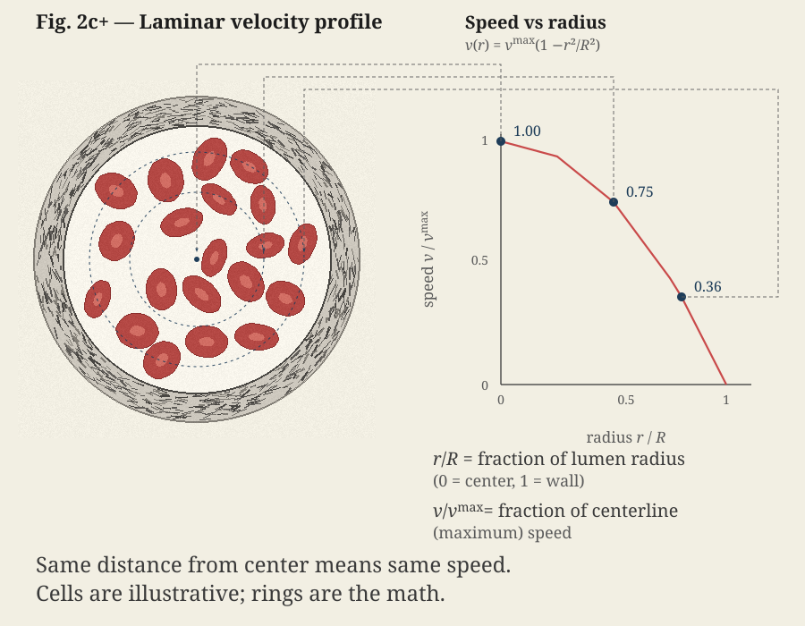
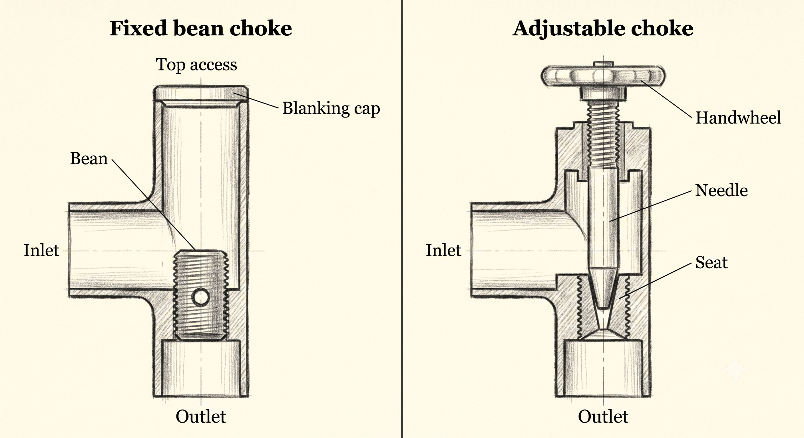

# Act 2: The Narrowing

**DR. SARAH HAYES**
Okay, we're ready to control the flow. Stuart, hold this retractor right there. Let's clamp the proximal end first.

**MARK**
[*Watches the ceiling, sweating*]
Clamping the flow. That's a valve shut-in.

**DR. SARAH HAYES**
[*With a firm but gentle click, she locks a vascular clamp across the artery. She watches the field go quiet.*]

Good. Proximal control. Field's dry.

**MARK**
[*A small flinch at the click; eyes still on the ceiling*]
That's it? You just closed it?

**DR. SARAH HAYES**
[*Looks over the screen to Mark*]
Proximal clamp's on. Bleeding's stopped on this side.

**MARK**
[*Trying to map it to something he knows*]
On a well, you'd see that shut-in on the gauges—pressure jumps upstream the second the valve closes. That's why we hang transducers. Early warning. So… you saw the spike?

**DR. SARAH HAYES**
I saw the field go quiet. Cuff on your other arm reads every few minutes. Not continuous.

**MARK**
[*A short, incredulous laugh*]
Every few minutes. After a shut-in.

<!-- stage-break -->

**DR. SARAH HAYES**
[*Back to the field*]
For a case like this, yes. Continuous means an arterial line—a thin catheter in an artery, live waveform. Infection, clot, hematoma; rare, but you can lose the pulse downstream. We only put one in when not seeing beat-to-beat is the bigger risk—unstable pressure, frequent blood gas draws, big cases. Yours doesn't clear that bar.

> [!NOTE]
> **Shut-In Transients**
> Sudden closure stops the flow and sends a pressure wave back upstream. In an elastic vessel the spike **damps** quickly; in stiff steel pipe the same spike **rings** (well knocking). An **arterial line** (or a well transducer) does not cause that — it is how you would *measure* the waveform if you had continuous pressure monitoring.

**ELENA**
[*Checking the cuff cycle on the vitals monitor*]
We don't instrument for sport.

**STUART**
[*Still holding retractors, thinking out loud*]
But if we *did* have an arterial line upstream of the clamp—the waveform would spike, and the dicrotic notch would wash out from the reflection.

**DR. SARAH HAYES**
[*Without looking up, she steadies the clamped vessel with forceps*]
Ten points for quoting the physiology textbook verbatim, Stuart. And yes—that's what you'd see. The clamp creates a complete reflection boundary. When we shut off a major branch, that reflected pressure wave travels backward toward the heart. If this were a larger vessel, like the aorta, the sudden increase in afterload could strain the left ventricle. In peripheral vessels, we listen for that reflection or obstruction. If there's a partial blockage downstream, the turbulence creates a murmur—or what we call a bruit.

**MARK**
[*Nervously tapping his free hand against the arm board*]
The first time I realized what water hammer could do, a valve slammed on a platform and blew a gasket on the discharge flange. We were down most of the shift fixing it. After that we were a little more careful to open valves slowly on restart. It's a transient shock wave in the line, what we call well knocking. We listen for it the same way you listen for a bruit.

**DR. SARAH HAYES**
[*Gently dabbing the tissue with gauze*]
And keeping that flow path clear is everything. Elena, pass the irrigation syringe and a fine retractor. Stuart, hold this retracting loop. We need to expose the bifurcation.

[*Elena hands Dr. Hayes a syringe of saline. Dr. Hayes washes the wound. Stuart takes the retractor, holding the exposure.*]

<!-- stage-break -->

**STUART**
[*Adjusting his grip*]
It's all about diameter. Even a tiny reduction in the vessel's radius drastically increases resistance. In physiology, we learn Poiseuille's law. Resistance to flow is inversely proportional to the fourth power of the radius.

**MARK**
[*Shifting his head toward Stuart*]
Yeah. We see that in oil too. You close a choke down a little and you give up a lot of pressure. Same if scale narrows a line—small change in diameter, big hit on what you can push through.

**DR. SARAH HAYES**
[*Chuckling softly behind her mask*]
And blood vessels aren't straight rigid pipes. They're curved, tapered, elastic, and branch continuously. And blood is non-Newtonian—it's shear-thinning. At high shear rates in the large arteries, the red blood cells deform and align, lowering the viscosity. But in the micro-circulation, where the shear rate drops, they clump together, and viscosity climbs.

**MARK**
Exactly. And when you have a narrowing—a restriction in a vessel, or a choke valve in a wellbore—those ideal assumptions break down completely.

**DR. SARAH HAYES**
We call that a stenosis.

**MARK**
Right, a stenosis.

<!-- stage-break -->

**MARK**
Elena, can you hand me my notepad? The clean page.

[*Elena reaches for the metal-backed clipboard on Mark's side table, flipping to his fresh sketch.*]

**MARK**
Look at this sketch here.

[*Elena holds the clipboard up under the bright surgical lights. Stuart leans in slightly while keeping the suction tip steady in his left hand.*]

**MARK**
A well will often flow harder than you want, so we use a choke—a narrow opening we can set—to bring the flow rate down. Same amount of fluid still has to pass that opening, so it speeds up, and you don't get that pressure back clean on the other side. Same idea as your stenosis.

**STUART**
And the pressure curve does the opposite—it drops dramatically at the throat. It's the Bernoulli principle. The kinetic energy increases, so the static pressure must drop.

**MARK**
[*Points to the chaotic swirls in Profile B*]
Right. I've seen that after an eroded choke bean on a surface line. Gauges bouncing, pressure loss we couldn't explain until we opened that section of pipe and found recirculation downstream of the throat. Same thing here. The velocity jet exits the constriction, sudden expansion, flow separation. Fluid can't decelerate smoothly, so the kinetic energy goes into recirculating eddies. That's turbulence. Stuart: Reynolds number. Density times velocity times diameter, over viscosity. Once that climbs, laminar is gone and you're burning pressure for nothing.

> [!NOTE]
> **The Reynolds Number ($Re$)**
> $Re = \frac{\rho v d}{\mu}$
> Always positive, ranging from 0 to ∞.
> **Re < 2,300**: Laminar (smooth, predictable flow)
> **2,300 < Re < 4,000**: Transition zone (intermittent flickering)
> **Re > 4,000**: Fully turbulent (chaotic eddies)
> The ~2,300 threshold was determined experimentally by Osborne Reynolds in 1883 by injecting dye into pipe flow and watching when the smooth streak broke apart.

**DR. SARAH HAYES**
[*Cleaning the outer surface of the artery; a glance at Mark's sketch*]
And in a blood vessel, that downstream turbulence isn't just an energy loss—which shows up as that permanent pressure drop. It's biologically active. The chaotic flow and high shear stresses physically deform the endothelial cells lining the vessel.

[*To Stuart, teaching tone.*]

Stuart, what do platelets do when they're exposed to high shear and turbulence?

**STUART**
They activate, change shape, release dense granules, and aggregate. It triggers the coagulation cascade, forming a thrombus right downstream of the stenosis.

**DR. SARAH HAYES**
Good. So now think it through. You've got a minor plaque narrowing. It accelerates the flow. The turbulence activates platelets. What happens next?

**STUART**
[*Pausing, then his eyes widening*]
The clot narrows it further... which accelerates the flow even more... which activates more platelets...

**DR. SARAH HAYES**
Keep going.

**STUART**
It's a positive feedback loop. It runs away until you get total occlusion.

**DR. SARAH HAYES**
And if that vessel feeds the myocardium?

**STUART**
[*Quietly*]
Myocardial infarction. A heart attack.

**MARK**
[*Frowning at the ceiling*]
Occlusion — you mean a total blockage? So the turbulence tricks the body into thinking it's injured, and the repair response plugs it off completely? That's a runaway blowout.

[*A brief silence falls over the room. The steady beep of the heart monitor fills the space.*]

**DR. SARAH HAYES**
[*Quietly, returning her focus to the wound*]
Which is exactly why we're here tonight.

[*Flat, to Stuart.*]

Stuart, let's irrigate this field. I need it pristine before we go any further.

