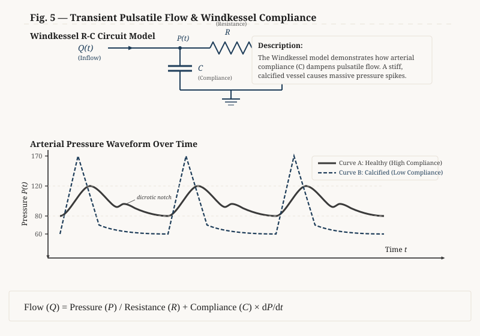
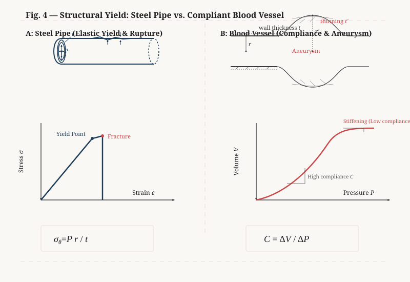

# The Hydraulic Conversation

## Act 4: Living Pipes

**SETTING:**
An operating room. Dr. Hayes is preparing the Prolene sutures for the arterial anastomosis. Stuart holds the suction and assists. Elena is preparing the suture line. Mark lies on the operating table under a regional block.

---

**DR. SARAH HAYES**
*[Without looking up, she takes the micro-needle holder loaded with a 6-0 Prolene suture from Elena]*
Which is exactly why biology doesn't use steel. Living blood vessels are compliant. They expand during systole to accommodate the bolus of blood ejected by the heart, and contract during diastole.

**DR. SARAH HAYES**
Stuart, what do we call the mechanism that smooths out the pulsatile flow from the heart?

**STUART**
*[Carefully adjusting the Senn retractor to maintain exposure of the artery's proximal end]*
The Windkessel effect. The aorta acts as a temporary elastic reservoir, storing energy during systole and releasing it during diastole to maintain continuous perfusion.

**MARK**
*[Nervously shifting his head, his left hand tapping the side table]*
In my world, we call that fluid-structure interaction, or FSI. We use gas-charged accumulators or surge tanks in pipeline networks to damp out pressure transients. Without that compliance, every stroke of a reciprocating pump would send a massive hammer wave through the line. The pressure spikes would fatigue the welds and blow out the flanges.

**DR. SARAH HAYES**
*[Gently irrigating the exposed artery with heparinized saline to prevent local clot formation]*
That’s exactly what happens when vessels stiffen with age or atherosclerosis. The compliance drops, and the system loses its damping capacity. Stuart, hold that suction tip right at the adventitial edge. Don't touch the intima.

**STUART**
*[Nods, stabilizing his hand and clearing a small pool of saline]*
Understood. If the wall is rigid, the pressure waveform changes.

**MARK**
*[Reaching for his notepad with his free left hand, Elena holds the page steady as he points to a pre-existing sketch]*
Like this one. I drew this out earlier when we were talking about transients.

*[Elena holds the notepad up so Dr. Hayes and Stuart can see the sketch under the surgical lights.]*

**MARK**
Look at the RC circuit analogy at the top—electrical resistance standing in for viscous fluid friction, and capacitance representing the compliance of the elastic walls. If compliance is high, like Curve A, you get a smooth, damp wave with a nice dicrotic notch from the valve closure. But if compliance drops—Curve B—the wave becomes sharp, jagged, and high-amplitude. The peak pressure spikes dramatically.

**DR. SARAH HAYES**
*[Peering through her surgical loupes, aligning the cut edges of the vessel]*
Yes, and that high-amplitude pressure wave travels downstream, damaging the delicate micro-circulation. But the physics is even more complex because the fluid itself isn't simple water.

**DR. SARAH HAYES**
Stuart, is blood a Newtonian fluid?

**STUART**
*[Shaking his head]*
No, it's shear-thinning. Under high shear rates in major arteries, the viscosity drops. But at low shear rates, the red cells aggregate into rouleaux formations and the viscosity climbs.

**DR. SARAH HAYES**
Good. And what happens when circulation stops completely?

**STUART**
It has a yield stress—it gels up. That's part of why stagnant blood clots.

**MARK**
*[His eyes widening]*
Yield stress and shear-thinning? You're describing drilling muds. When we drill a well, we pump bentonite slurries or thixotropic polymer fluids down the drill string. When circulation stops, we need the mud to gel up—that's the yield stress—so the heavy rock cuttings don't settle back down and pack off the drill bit. But the second we restart the pumps, the shear stresses break the gel, the viscosity thins out, and it flows easily. You're telling me my body is pumping a thixotropic slurry through self-damping, elastic hoses?

**DR. SARAH HAYES**
*[A warm smile visible behind her mask]*
Essentially, yes. Though our thixotropic slurry will clot solid if we let it sit still for too long, which is why we have to keep these clamps temporary. Elena, pass the micro-forceps.

*[Elena places the fine jeweler's forceps into Dr. Hayes's hand. Dr. Hayes gently handles the vessel wall.]*

**DR. SARAH HAYES**
Look at the structural difference here. When your steel pipes fail under too much pressure, how does it look?

**MARK**
Well, it's a yield failure. Hoop stress—the circumferential tension in the pipe wall—is defined by the pressure times the radius divided by the wall thickness: $\sigma_\theta = \frac{Pr}{t}$. If the pressure exceeds the ultimate tensile strength of the steel, the pipe undergoes plastic deformation, thins out, and splits. It's a sudden, localized rupture.

*[Mark flips the page on his notepad to show another drawing]*

**MARK**
Left panel shows the steel casing under hoop stress, and the split failure when it yields. But look at the living vessel on the right.

**DR. SARAH HAYES**
*[Stitching a stay suture at the corner of the vessel]*
That right panel is the perfect model of an abdominal aortic aneurysm. As the arterial wall degenerates and loses its elastic fibers, the radius ballooning outwards increases, and the wall thickness decreases. By Laplace’s law, that balloon-like expansion drives the hoop stress up exponentially, even if the systemic pressure doesn't change. It's a runaway loop: more expansion leads to more stress, which causes more expansion, until the tissue simply tears.

**MARK**
A runaway failure under pressure. That's exactly how blowouts happen in our wells. Take the Deepwater Horizon in 2010. It was a cascade of barrier failures. The cement barrier at the bottom of the wellbore failed under high pressure, letting natural gas leak into the casing. As that gas migrated up the well, the hydrostatic pressure of the drilling mud column above it decreased. And because the pressure decreased, the gas expanded exponentially according to Boyle's law. It displaced the drilling mud, pushing it up and out of the riser. Once the mud was gone, the hydrostatic head was completely lost, and the reservoir pressure blew out uncontrollably at the surface.

**DR. SARAH HAYES**
*[Her expression turns serious as she listens, keeping her hands perfectly steady]*
The medical equivalent of that well blowout is a ruptured aneurysm. Once the vessel wall gives way, the high-pressure blood breaches the barrier. It blows out into the retroperitoneal or abdominal cavity. There is no mechanical barrier to contain it. The pressure drop is immediate, and the blood loss is catastrophic. The patient enters deep hypovolemic shock within minutes as the circulating volume is depleted. It is a complete and sudden loss of hydrostatic containment.

**STUART**
*[Tensely]*
And without immediate surgical clamping to restore containment, it’s fatal.

**DR. SARAH HAYES**
*[Adjusting the tension on the first stay suture]*
Exactly. Which is why we respect the pressure. Elena, prepare the 7-0 suture line. Stuart, keep the suction steady right on the adventitial margin. I need the lumen completely clear of blood for the first stitch.

*[Elena passes the micro-needle holder. Dr. Hayes adjusts the surgical loupes, leaning in close to the wound under the bright lights. She grips the micro-needle holder. Stuart holds the suction tip perfectly still, clearing a tiny bead of blood from the arterial edge. Dr. Hayes is suturing the vessel under magnification.]*

**DR. SARAH HAYES**
I'm starting the anastomosis now. Micro-sutures. We have to stitch this without narrowing the lumen too much, or we'll trigger the fourth-power resistance drop Stuart mentioned. But we can't see the flow inside yet. We'll have to infer it.

**MARK**
Inferring the unseen. That's my entire job.
