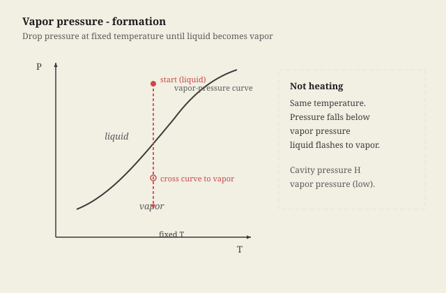
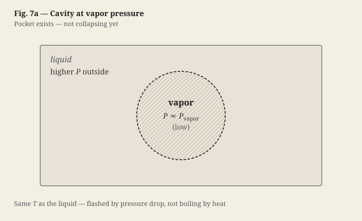
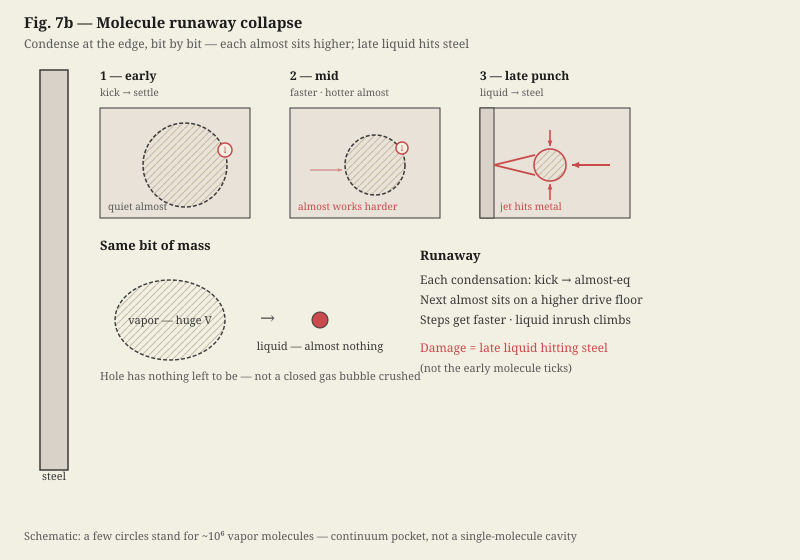
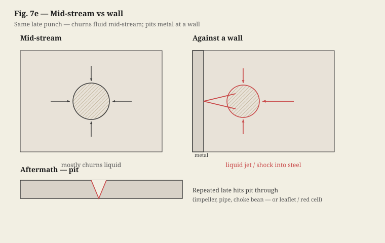

# Act 3: The Network

**MARK**
[*Eyes on the ceiling, settled — shop talk, not panic*]
That pressure drop at the throat Stuart walked through—we've seen it go further. You speed the flow up hard enough, static pressure falls below vapor pressure, and you get little vapor cavities sitting in liquid that's still ambient temperature. Cavitation. I've seen centrifugal pump impellers pitted through from it. I couldn't imagine what that could do to tissue. Do you guys ever see that?

**DR. SARAH HAYES**
[*Adjusting loupes, damp sponge at the clamp — field-first*]
We do—mechanical heart valves. Leaflets slam shut, local pressure drops below blood's vapor pressure, micro-bubbles form and collapse on the valve or on red cells. That rupture is hemolysis; it also activates platelets. That's why mechanical-valve patients stay on warfarin—clots from that mechanical trauma.

**STUART**
So blood vaporizes?

**MARK**
[*Still on the ceiling*]
Yeah—Boyle's law, or the ideal gas law if you like: all else equal, drop the pressure and liquid can flash to vapor.

> [!NOTE]
> **Ideal gas / Boyle (shortcut)**
> $$PV = nRT$$
> Lower \(P\) favors vapor at fixed \(T\). Later, when pressure recovers, condensation **removes** vapor from the cavity — not a closed gas bubble being crushed.

**STUART**
[*A short blank — then back in*]
Right.

<!-- stage-break -->

[*Hayes and Stuart go heads-down on the vessel ends — trim, irrigate, flush. Clipped field only. Mark keeps talking to the ceiling — think-aloud, not waiting for nods.*]

**DR. SARAH HAYES**
[*Without looking up*]
Irrigate.

**MARK**
Not the whole arm turning to steam—just little cavities when you dip under vapor pressure at the same temperature, so you've got a pocket sitting there at that low pressure.

<!-- stage-break -->

**MARK**
Downstream the flow slows, pressure comes back up, and that vapor isn't happy being vapor anymore. It leaves at the edge—bit by bit, a molecule joins the liquid, kicks the boundary, settles almost quiet… but never as quiet as before. Each bit makes the next come harder and faster. As vapor that little bit claimed a huge share of the hole; as liquid it packs into almost nothing, so the hole has nothing left to be. Outside liquid's still at higher pressure, so it piles in as the hole disappears—and against a wall that pile-in is your punch. Liquid hitting steel. Enough times you pit through.

<!-- stage-break -->

**MARK**
[*Still ceiling; field still busy*]
Mid-stream it mostly churns fluid. Against a wall—impeller, pipe, choke bean—same collapse, but the liquid slams metal.

**DR. SARAH HAYES**
[*A beat; still in the field, not looking up*]
I knew the damage. I hadn't put the vanishing that cleanly. Same punch on a leaflet—or a red cell.

<!-- stage-break -->

**MARK**
Let's look at the next page of my sketch.

[*Elena carefully flips the clipboard page to reveal the next diagram.*]

**MARK**
The branching tree—main inlet into the aorta, then smaller arteries with their own resistances and flows. Parallel network. Total resistance stays below any single branch. That's how you feed a bunch of organs without needing a ridiculous pressure head at the pump.

> [!NOTE]
> **Parallel Hydraulic Resistance**
> $$\frac{1}{R_{\mathrm{total}}} = \sum_{i} \frac{1}{R_{i}}$$
> \(R_i\): resistance of branch \(i\). \(R_{\mathrm{total}}\): resistance of the parallel network. More open branches → lower \(R_{\mathrm{total}}\).

**STUART**
And once it branches hard enough, total cross-sectional area balloons—tiny in the aorta, huge through the arterioles and capillaries. Continuity: mean velocity falls as area climbs. Fastest leaving the heart, crawl in the capillary bed.

> [!NOTE]
> **Continuity Equation**
> $$Q = A \cdot v$$
> \(Q\): volumetric flow rate. \(A\): total cross-sectional area. \(v\): mean velocity. Same \(Q\) through a wider bed means slower \(v\)—why capillaries crawl.

**DR. SARAH HAYES**
[*Nodding; hands still in the field, intensity eased*]
That's what you want in the capillary bed. Blood slows enough for oxygen and nutrients to diffuse across the endothelium. At aortic speed through capillaries, tissue would starve.

**MARK**
It's the exact same principle we use in gravel packs and reservoir sands. We slow down the fluid velocity near the wellbore by expanding the flow area, preventing high-velocity erosion and sand production.

**DR. SARAH HAYES**
[*Taking a saline syringe from Elena; a glance over the screen to Mark*]
We're doing it with tissue, not gravel.

[*She gently washes the wound with saline, the fluid pooling and carrying away tiny drops of blood. Voice back to the table.*]

**DR. SARAH HAYES**
Stuart, irrigate here. Let's clear this field. The tissue walls here are incredibly delicate—look at the adventitia. They aren't steel.

**MARK**
Yeah — casing doesn't flex with every stroke. It just sits under load until something yields.
