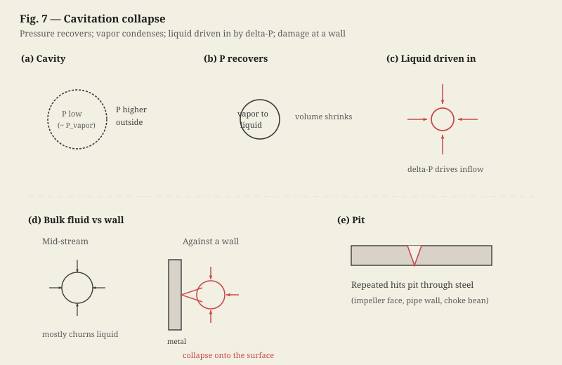

# Act 3: The Network

**MARK**
[*His eyes wide, staring at the ceiling tiles*]
That pressure drop at the throat Stuart walked through—we've seen it go further. Speed up hard enough, static pressure falls below the vapor pressure, and the liquid turns to vapor—little cavities, still at ambient temperature. Cavitation. I've seen centrifugal pump impellers pitted through from it. Downstream the flow slows, pressure comes back up. Above vapor pressure that vapor isn't stable anymore, so it condenses—liquid again, tiny volume. While the cavity was there, pressure inside was low and pressure outside was higher, so as it disappears the surrounding liquid is driven in by that difference. Out in the middle of the flow that mostly just churns liquid. Against a wall—pipe wall, impeller face, same idea—the cavity collapses onto the surface, so the punch hits steel. Enough times and it pits through. I couldn't imagine what that could do to tissue. Do you guys ever see that?

**DR. SARAH HAYES**
[*Adjusting her loupes, placing a damp sponge around the clamp*]
We do—mechanical heart valves. Leaflets slam shut, local pressure drops below blood's vapor pressure, micro-bubbles form and collapse on the valve or on red cells. That rupture is hemolysis; it also activates platelets. That's why mechanical-valve patients stay on warfarin—clots from that mechanical trauma.

**STUART**
So blood vaporizes?

**MARK**
So the whole system is a balance of pressure gradients and local geometries.

<!-- stage-break -->

**MARK**
Let's look at the next page of my sketch.

[*Elena carefully flips the clipboard page to reveal the next diagram.*]

**MARK**
Look at the left panel, the Vascular Branching Tree. You have a main inlet flow entering the aorta, which branches into smaller arteries with their own individual resistances and flow rates. It's a parallel network. The total resistance of a parallel system is always less than the resistance of any single branch. That's how you distribute flow to different organs without needing a massive pressure head at the main pump.

> [!NOTE]
> **Parallel Hydraulic Resistance**
> $$\frac{1}{R_{total}} = \sum \frac{1}{R_i}$$
> The total resistance of the vascular bed drops as more parallel branches are added.

**STUART**
And look at the graph on the right. The total cross-sectional area is tiny in the aorta, but it increases exponentially as the vessels branch into millions of arterioles and capillaries, peaking in the capillary bed. Because of the continuity equation, the mean flow velocity is inversely proportional to the total area. So, velocity is highest in the aorta and drops to an absolute minimum in the capillaries.

> [!NOTE]
> **Continuity Equation**
> $$Q = A \cdot v$$
> To maintain a constant flow rate $Q$, if the area $A$ increases, the velocity $v$ must decrease.

**DR. SARAH HAYES**
[*Nodding in agreement, her hands moving back to the surgical field*]
Which is perfect for physiology. The blood slows down to a crawl in the capillaries—that minimum-velocity region on your graph—giving oxygen and nutrients enough time to diffuse across the single-cell-thick endothelial walls into the tissue. If blood moved through the capillaries at the speed it leaves the heart, we'd starve of oxygen.

**MARK**
It's the exact same principle we use in gravel packs and reservoir sands. We slow down the fluid velocity near the wellbore by expanding the flow area, preventing high-velocity erosion and sand production.

**DR. SARAH HAYES**
[*Taking a saline syringe from Elena; still half in the conversation*]
Everything in the body is designed to manage these gradients without structural failure. But we're working with living cells, not synthetic composites.

[*Dr. Hayes gently washes the wound with saline, the fluid pooling and carrying away tiny drops of blood. Voice back to the table.*]

**DR. SARAH HAYES**
Stuart, irrigate here. Let's clear this field. The tissue walls here are incredibly delicate—look at the adventitia. They aren't steel.

**MARK**
No. Steel pipes don't breathe. They just sit there and take the pressure until they don't.
