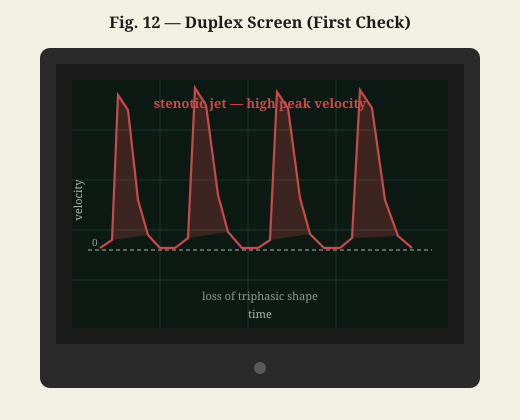
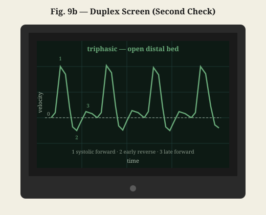
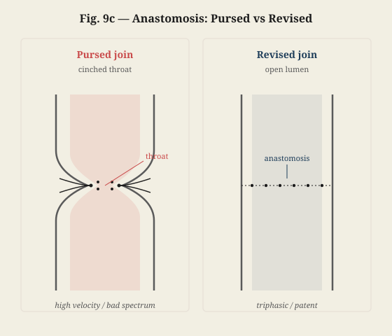

# The Hydraulic Conversation

## Act 5: Inverse Problems

**DR. SARAH HAYES**
Elena, prepare the 7-0 suture line. Stuart, keep the suction steady right on the adventitial margin. I need the lumen completely clear of blood for the first stitch.

[*Elena passes the needle holder. Dr. Hayes adjusts her loupes and leans in close to the wound. Stuart holds the suction tip still, clearing a bead of blood from the vessel edge.*]

**DR. SARAH HAYES**
[*Eyes on the vessel, voice flat*]
Starting the anastomosis. Stuart—don't let me purse these bites. We narrow this lumen, resistance climbs. Hard.

[*She places the first stitch. A beat. She looks over the screen to Mark—softer.*]

Mark—I'm sewing the artery back together now. You won't feel it. When we're done we'll check the flow with duplex Doppler—probe and screen. Until then I'm watching the wall, not blood moving through it.

**MARK**
[*Eyes on the ceiling lights, free fingers twitching against the drape*]
I can't see any of that. Arm's just… blank. You're sewing it without watching the flow?

**DR. SARAH HAYES**
[*Already back to the field*]
The join, yes. The flow comes after.

**MARK**
[*A thin breath*]
Then we're the same. I never see inside the reservoir either. That's my entire job—working from the outside.

**DR. SARAH HAYES**
[*Still not looking up, looping the fine suture with steady precision*]
How so?

**MARK**
[*Nervously twitching his fingers, his eyes tracking the surgical light*]
Well, we can't actually go down into the reservoir. It's two miles beneath the seabed. We have no eyes down there. We can't see the spatial distribution of permeability or porosity. All we have are boundary measurements—pressures and flow rates measured at the wellhead over time. So we solve an inverse problem. We call it history matching. We build a numerical grid model of the reservoir, assign initial guesses to the permeability in each grid cell, and then run a forward simulation: how much fluid a pressure gradient can push through the rock against viscosity. Same idea as resistance in a pipe, except the "pipe" is a tangled pore network—what we call Darcy's law.

**STUART**
[*Gently retracting the wound edge, squinting under the bright overhead light*]
So you calculate what the wellhead pressure *should* be, and compare it to the actual sensor data?

**MARK**
[*Tapping his fingers as much as the sterile drapes allow*]
Exactly. The measurement is the easy part—pressure transducers at the wellhead, writing down what they actually see over time. The calculation is the hard part: we guess a permeability map, run Darcy's law forward through every grid cell, and the model tells us what the wellhead pressure *ought* to be. Then we keep adjusting those guesses until the calculated pressure tracks the transducer record.

> [!NOTE]
> **Measurement vs Calculation (History Matching)**
> **Measurement** $P_{\mathrm{obs}}(t)$: wellhead pressure from the transducers
> **Calculation** $P_{\mathrm{calc}}(t)$: wellhead pressure predicted by the Darcy forward model
> $J = \sum_{t} [ P_{\mathrm{obs}}(t) - P_{\mathrm{calc}}(t) ]^2$
> Tune the unseen permeability map (and compliance) until the calculated wellhead pressure matches what the sensors recorded.

**DR. SARAH HAYES**
[*Taking scissors from Elena to cut the suture end; then looks over the screen to Mark*]
We do something close, Mark. Outside measurements. We can't open every vessel just to check flow or resistance. Duplex ultrasound—image plus spectral Doppler. Non-invasive diagnostics.

**STUART**
[*Nodding eagerly*]
Right. The duplex probe measures the frequency shift of the sound waves bouncing off the moving red blood cells. Velocity shows up on the spectral display. From that peak velocity we reconstruct the pressure drop across a stenosis using the simplified Bernoulli equation.

> [!NOTE]
> **Simplified Bernoulli Equation (Clinical)**
> $\Delta P \approx 4v^2$
> A fast clinical heuristic where peak velocity $v$ directly estimates the pressure gradient $\Delta P$ across a heart valve or stenosis.

**DR. SARAH HAYES**
[*Adjusting the angle of her surgical loupes*]
And if we need a more detailed map of the geometry, Stuart, what do we use?

**STUART**
CT angiography—inject contrast and take a CT scan so we can reconstruct the three-dimensional lumen. Then we can feed that geometry into a computational fluid dynamics model.

**DR. SARAH HAYES**
And if we need velocity data without contrast or radiation?

**STUART**
Phase-contrast MRI. It maps velocity vectors in three dimensions, so you can calculate wall shear stress and pressure gradients directly from the flow field.

**DR. SARAH HAYES**
[*To Stuart*]
Exactly. Mapping the inside from signals at the edge.

[*Looks over the screen to Mark, softer*]
Let's hope my physical model matches the math.

[*She places the final micro-suture. Voice flat again, to the table.*]

Elena, saline irrigator.

[*Elena passes the saline syringe. Dr. Hayes flushes the wound, checking that the suture line sits clean and even.*]

**DR. SARAH HAYES**
Ready to restore flow. Stuart, get the suction ready. Elena, micro-forceps.

[*Dr. Hayes positions her fingers over the clamps. She releases the far clamp first, letting blood flush back through the repair, then releases the near clamp.*]

**STUART**
[*Leaning forward, his breath catching*]
The vessel is filling...

[*The repaired artery begins to swell, its walls pulsing in time with Mark's heartbeat.*]

<!-- stage-break -->

**DR. SARAH HAYES**
Anastomosis is patent. No suture line bleeding. Stuart, roll up the duplex.

[*Stuart brings the sterile probe and the small screen to the field. Dr. Hayes gels the tip, seats it on the pulsing artery, glances at the display—then thumbs the speaker on.*]

**DR. SARAH HAYES**
Speaker on. I still like hearing it. You watch the screen.

[*A harsh, high-pitched rasp fills the room—wrong. On the screen the spectrum spikes tall and ugly.*]

**STUART**
[*Smile gone*]
That's not triphasic. Peak velocity's through the roof.

**DR. SARAH HAYES**
[*Voice flat*]
Pursed. Clamp back on. We're revising.

[*Elena and Stuart go still. Dr. Hayes re-clamps, cuts out the cinching bite, and replaces it—quiet, fast, no teaching.*]

<!-- stage-break -->

**DR. SARAH HAYES**
Unclamp. Duplex again.

[*Speaker still on: a clean rhythmic WHOOSH-chhh, WHOOSH-chhh. On the screen the spectrum opens into a clean triphasic trace.*]

**STUART**
[*Breathing out*]
Strong triphasic flow. The waveform is beautiful.

<!-- stage-break -->

**DR. SARAH HAYES**
[*Handing the probe back*]
That first join had cinched a little throat. Leave a throat like that and it clots—or it fails downstream. So we cut it and put it back open.

> [!NOTE]
> **Duplex spectral Doppler**
> **Triphasic** (good): sharp systolic forward peak, brief early-diastolic reverse, low late-diastolic forward — open runoff.
> **Stenotic / pursed** (bad): high peak velocity through the throat and loss of the normal triphasic shape — same idea as Act 2: velocity up at a restriction, pressure drop by simplified Bernoulli $\Delta P \approx 4v^2$.

**MARK**
[*Quiet, then*]
Oh—like a choke. You'd never leave a bean that tight in a flowline. Same throat.

**DR. SARAH HAYES**
[*A short nod*]
Same physics.

**MARK**
Difference is you can open the pipe and sew it again. I get a bad gauge signature two miles down and I don't get to climb in with a needle.

**DR. SARAH HAYES**
[*Almost a smile*]
Lucky me.

<!-- stage-break -->

**DR. SARAH HAYES**
Elena, let's close. We'll use 4-0 Monocryl for the subcutaneous layer and Dermabond for the skin.

[*Dr. Hayes begins closing the deeper layers while Elena prepares the dressings. Stuart helps with the skin. Within a few minutes, Elena wraps a clean bandage around Mark's arm.*]

**DR. SARAH HAYES**
[*Looks over the screen to Mark, gloves still on*]
All done, Mark. Joined and sealed—no leaks.

**MARK**
[*Sighing with relief, his shoulders finally relaxing on the table*]
Thanks, Doc. I have to say, the pressure drop in my arm was a lot easier to fix than a pressure leak in a deepwater well. We don't have the luxury of putting sutures on a reservoir two miles down.

**DR. SARAH HAYES**
[*Pulling off her surgical gloves with a sharp snap and smiling warmly*]
Yes, well, you have to remember that I've had the benefit of several billion years of biological R&D to refine my vascular pipes. Evolution is a very patient engineer. Your steel casings have only had about a century.

**MARK**
[*Dryly*]
I'll make sure to mention that to our reservoir modeling team. They could use a few million years of R&D.

[*The team laughs softly as Elena begins clearing the surgical trays.*]
