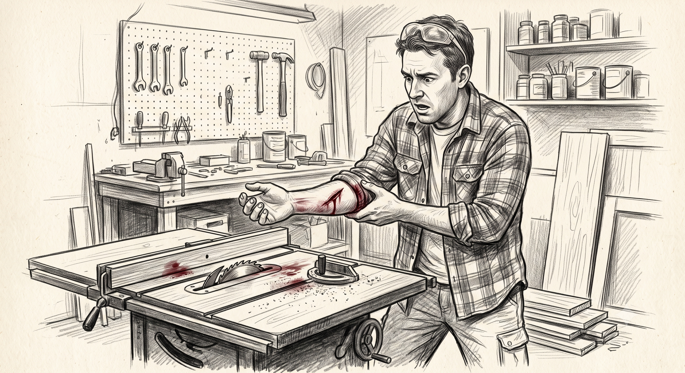
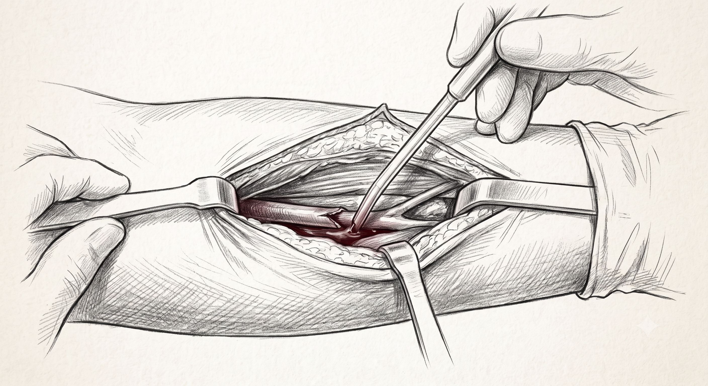
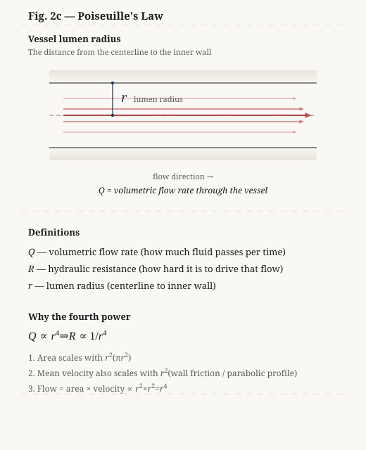
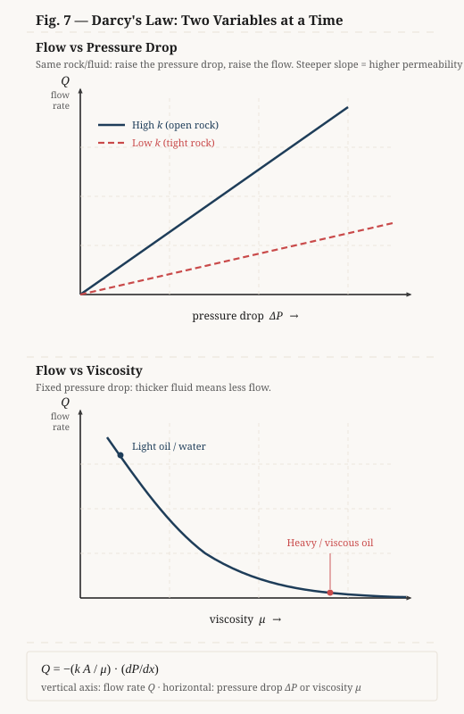

# Pulses and Pathways

## a Vascular Surgeon meets a Petroleum Engineer

  Preferred Presentation: This play is designed to be experienced with the script on center stage, and educational technical slides projected to the right.

# Dedication

This project is dedicated to the Reddit user [enquicity](https://www.reddit.com/user/enquicity/), whose brief recount of their surgery inspired this entire story.

*A special note from the author: I used Google Gemini to teach me in depth about both petroleum engineering and vascular surgery concepts so I could learn exactly how they're related, as I initially had only a shallow understanding of each—just enough to know there were underlying analogies waiting to be uncovered.*

# Act 1: The Bedside Question

<stage-row>
<play-text>

**Characters:**

* **DR. SARAH HAYES**: Vascular Surgeon. Calm, experienced, and observant.
* **MARK**: Patient. Anxious oil engineer, awake, arm numb from regional anesthesia.
* **STUART**: Third-year medical student, observing the surgery.
* **ELENA**: Circulating nurse, managing IV and vitals.

</play-text>
<projections>
</projections>
</stage-row>
---
<stage-row>
<play-text>

*[Scene Setting: Operating Room. The air is cool, hummed by the steady rhythm of the ventilation system. MARK lies supine on the operating table, his left arm extended on an armboard, prepped and draped. A screen at his shoulder hides the surgical field from his view; Dr. Hayes can look over it to meet his eyes when she speaks to him. A regional block has just been placed; they are waiting for it to set before going deeper. STUART stands beside her, observing. ELENA stands near the vitals monitor, adjusting the IV line.]*

**DR. SARAH HAYES**: *[Glancing at the clock, then over the screen to Mark]* Block's in. We'll give it another minute before I go further. I read the ED note, but I want to hear it from you. While we wait—tell me what happened to your arm.

**MARK**: *[Staring at the ceiling, swallowing]* I was in the garage, using the table saw to make a cabinet with sliding glass doors. The glass was a quarter-inch thick, so I put in a quarter-inch dado set—two blades together, wide enough to cut the groove in one pass. The groove didn't go through the board. The regular guard rides on a metal fin behind the blade, and that fin had nowhere to pass, so I took the assembly off. Just for that cut. I had the wood against the guide and was using a block to push it through. It twisted; the blade threw it back. My left hand slipped, and when I jerked away, the underside of my forearm caught the cutter. I pressed the first shop rag I could reach over it and ran next door to Steve's. He drove me in.

**STUART**: *[Quiet, almost to himself]* Mid-forearm… ulnar artery territory.

**DR. SARAH HAYES**: *[A short nod]* We'll see when we're in. Elena, saline ready when I ask for it.

*[She looks over the screen to Mark.]*

Mark—before I go further. I'm going to press here. Tell me: sharp, or just pressure?

*[A firm press on the forearm below the field.]*

**MARK**: *[Knuckles white on the table edge]* Not sharp. Just… weird. Like someone's rooting around in a kitchen drawer, but the drawer is my wrist.

**DR. SARAH HAYES**: *[A small nod; back to the field]* Good. That's what we want. The numbing's holding—you can feel pressure and movement, but cutting pain shouldn't get through. If anything turns sharp, say so.

**ELENA**: *[Checking the vitals monitor]* Heart rate is ninety-six, blood pressure is one-thirty-eight over eighty-two. Vitals are stable, but he's running a little fast.

**DR. SARAH HAYES**: *[Looks over the screen to Mark]* Completely normal under the circumstances. So, what is it you do, Mark?

**MARK**: *[Taking a shallow, rapid breath]* I'm an engineer. Reservoir and downhole hydraulics, offshore. We design the flow loops for drilling deep wells. Wellbore stability, hydrostatic balance, transient pressure modeling. It's... it's mostly math and physics, keeping the fluid columns from either collapsing the rock or blowing out the top.

</play-text>
<projections>

</projections>
</stage-row>
<stage-row>
<play-text>

**DR. SARAH HAYES**: *[Gently irrigating the wound with saline]* Hydrostatic balance. How does that work when you're drilling thousands of feet down?

**MARK**: *[Rambling quickly, his voice high-pitched]* It's all about density and depth. The formation rock is under immense pressure from the fluids trapped inside it. If we don't counter that pressure, the gas or oil kicks into the well, and you get a blowout. So we pump a dense drilling fluid, what we call drilling mud, down the drill pipe and up the annulus...

**STUART**: *[Frowning behind his mask]* The annulus? Like the mitral valve annulus?

**MARK**: Mitral—? I don't know what that is. In drilling, an annulus is just the empty ring-shaped space between the inner drill pipe and the outer steel casing. It's the return path. Anyway, we have to design the hydrostatic pressure to be greater than the pore pressure of the formation but less than the fracture pressure of the rock.

**STUART**: *[Leaning closer to the wound]* So the mud just sits there?

**MARK**: *[Shaking his head, staring at the ceiling]* No, it's constantly circulating. But the static base of it is just hydrostatic pressure — same rule as undergrad physics. Pressure is density times gravity times depth. Heavier mud, deeper hole, higher pressure at the bottom. If we don't control the density, the whole system destabilizes. If the mud is too light, the well kicks — sorry — formation fluid pushes into the wellbore. If it's too heavy, we fracture the reservoir and lose all our fluid into the rock, which drops the hydrostatic column and triggers a kick anyway. Same idea. It's a very tight window.

</play-text>
<projections>
</projections>
</stage-row>
<stage-row>
<play-text>

**DR. SARAH HAYES**: *[Using a suction tip to clear the surgical field]* And how do you model the flow along the well? If it's circulating, it's not static anymore.

**MARK**: *[Wiggling his uninjured right hand]* Right! Exactly. Once it's moving, you have to add the dynamic frictional losses. It becomes a hydrodynamic problem. It's tough to explain without drawing. I'm a visual guy, Dr. Hayes. If I don't draw, my brain just focuses on what you're doing over there.

</play-text>
<projections>

<strong>Hydrostatic Pressure</strong>

$$P_h = \rho g z$$

Pressure ($P_h$) increases linearly with depth ($z$), assuming constant fluid density ($\rho$) and gravity ($g$).

</projections>
</stage-row>
<stage-row>
<play-text>

**DR. SARAH HAYES**: *[Chuckles]* Stuart, let's help him out. Is there a sterile marker and a clean drape packet backing?

**STUART**: *[Retrieves a sterile skin marker and grabs a clean, stiff paper backing from a drape pack, holding it up in front of Mark's face]* Here you go, Mark. Draw it out. I'll hold it steady for you.

**MARK**: *[Takes the marker with his right hand and begins sketching rapidly on the paper backing, his hand trembling slightly but drawing clean, precise lines. He draws a concentric pipe diagram, arrows indicating flow direction, a graph, and the governing hydrostatic equation]* Okay, look. This is how we visualize the system.

**MARK**: *[Pointing with the marker]* In the top panel, you see the physical layout. The outer boundary is the steel casing. The inner tube is the drill pipe. The mud goes down the inside of the drill pipe and comes up that gap between them we just talked about—the annulus. And the mud is thick. It's not like water. It's basically a clay slurry. It won't even start flowing until you push it hard enough, and once it does start moving, it actually thins out the faster you pump it.

</play-text>
<projections>

</projections>
</stage-row>
<stage-row class="projections-end">
<play-text>

**DR. SARAH HAYES**: *[Carefully dissecting around the ulnar artery]* Fascinating. So the fluid doesn't just flow smoothly like water through a hose.

</play-text>
<projections>

</projections>
</stage-row>
<stage-row>
<play-text>

**MARK**: *[Nodding nervously]* Exactly! It moves more like a solid plug in the center, with all the shearing happening right against the walls. Plus, the drill pipe is rotating, which churns the fluid even more. The graph in the bottom panel of my sketch shows the hydrostatic pressure increasing linearly with depth. But when the pumps are on, the total pressure at any depth is the sum of the static weight of the fluid and the dynamic friction from pumping it.

**STUART**: *[Holding the retractor, eyes wide]* So the pressure is higher when you're pumping?

**MARK**: *[Sweat beads forming on his forehead]* Much higher. We call it the Equivalent Circulating Density, or ECD. It's the effective density the wellbore walls feel. If the ECD spikes because of high flow rates or a restriction in the annulus, we risk breaking the formation. We run computer simulations on it, breaking the whole well down into chunks. You can't just calculate it on paper because the mud gets compressed and heated the deeper it goes, changing how it flows at every single foot.

**DR. SARAH HAYES**: *[Locating the lacerated vessel, her movements precise]* There. Ulnar artery. Torn—but the ends look clean enough to work with.

</play-text>
<projections>
</projections>
</stage-row>

# The Hydraulic Conversation

## Act 2: The Narrowing

<stage-row>
<play-text>

**SETTING:**
An operating room. A screen at Mark's shoulder hides the field from him; Dr. Hayes can look over it to meet his eyes. Dr. Hayes is ready to control the flow at the lacerated artery. Stuart is retracting and assisting with suction. Elena is passing instruments. Mark lies on the operating table, awake, his arm numb from regional anesthesia.

</play-text>
<projections>
</projections>
</stage-row>
---
<stage-row>
<play-text>

**DR. SARAH HAYES**
Okay, we're ready to control the flow. Stuart, hold this retractor right there. Let's clamp the proximal end first.

**MARK**
*[Watches the ceiling, sweating]*
Clamping the flow. That's a valve shut-in.

**DR. SARAH HAYES**
*[With a firm but gentle click, she locks a vascular clamp across the artery. She watches the field go quiet.]*

Good. Proximal control. Field's dry.

**MARK**
*[A small flinch at the click; eyes still on the ceiling]*
That's it? You just closed it?

**DR. SARAH HAYES**
*[Looks over the screen to Mark]*
Proximal clamp's on. Bleeding's stopped on this side.

**MARK**
*[Trying to map it to something he knows]*
On a well, you'd see that shut-in on the gauges—pressure jumps upstream the second the valve closes. That's why we hang transducers. Early warning. So… you saw the spike?

**DR. SARAH HAYES**
I saw the field go quiet. Cuff on your other arm reads every few minutes. Not continuous.

**MARK**
*[A short, incredulous laugh]*
Every few minutes. After a shut-in.

**DR. SARAH HAYES**
*[Back to the field]*
For a case like this, yes. Continuous means an arterial line—a thin catheter in an artery, live waveform. Infection, clot, hematoma; rare, but you can lose the pulse downstream. We only put one in when not seeing beat-to-beat is the bigger risk—unstable pressure, frequent blood gas draws, big cases. Yours doesn't clear that bar.

**ELENA**
*[Checking the cuff cycle on the vitals monitor]*
We don't instrument for sport.

**STUART**
*[Still holding retractors, thinking out loud]*
But if we *did* have an arterial line upstream of the clamp—the waveform would spike, and the dicrotic notch would wash out from the reflection.

**DR. SARAH HAYES**
*[Without looking up, she steadies the clamped vessel with forceps]*
Ten points for quoting the physiology textbook verbatim, Stuart. And yes—that's what you'd see. The clamp creates a complete reflection boundary. When we shut off a major branch, that reflected pressure wave travels backward toward the heart. If this were a larger vessel, like the aorta, the sudden increase in afterload could strain the left ventricle. In peripheral vessels, we listen for that reflection or obstruction. If there's a partial blockage downstream, the turbulence creates a murmur—or what we call a bruit.

**MARK**
*[Nervously tapping his free hand against the arm board]*
We listen for the same thing in wells and pipelines. When a valve shuts in, it generates a transient shock wave—a water hammer—that bounces back and forth. We hear it as 'well knocking' or metallic pinging. The frequency and amplitude of the acoustic reflection tell us where the blockage or restriction is.

</play-text>
<projections>

</projections>
</stage-row>
<stage-row>
<play-text>

**DR. SARAH HAYES**
*[Gently dabbing the tissue with gauze]*
And keeping that flow path clear is everything. Elena, pass the irrigation syringe and a fine retractor. Stuart, hold this retracting loop. We need to expose the bifurcation.

*[Elena hands Dr. Hayes a syringe of saline. Dr. Hayes washes the wound. Stuart takes the retractor, holding the exposure.]*

</play-text>
<projections>

<strong>Acoustic Signatures of Turbulence</strong>

In both systems, a downstream restriction causes upstream flow turbulence that creates audible acoustic vibrations. A <strong>bruit</strong> is a continuous, low-frequency murmur, whereas <strong>well knocking</strong> presents as a sharp, high-amplitude transient spike.

</projections>
</stage-row>
<stage-row>
<play-text>

**STUART**
*[Adjusting his grip]*
It's all about diameter. Even a tiny reduction in the vessel's radius drastically increases resistance. In physiology, we learn Poiseuille's law. Resistance to flow is inversely proportional to the fourth power of the radius.

**MARK**
*[Shifting his head to look at Stuart]*
Hold on, Stuart. You're talking about the Hagen-Poiseuille equation. Do they teach you *why* it's to the fourth power in medical school?

**STUART**
*[Blinking, momentarily caught off guard]*
Well, it's just the formula for resistance.

**MARK**
It's just geometry! Flow is velocity times area. The cross-sectional area of a pipe is proportional to the radius squared. And the fluid velocity—because of the parabolic friction profile dragging against the walls—is *also* proportional to the radius squared. You multiply an $r$-squared area by an $r$-squared velocity, and you get an $r$ to the fourth power flow rate. But in engineering, we always qualify its assumptions. You can only rely on that inverse fourth-power rule if the flow is laminar, steady, and the fluid is Newtonian, running through a straight, rigid cylinder. Is your patient's artery a straight, rigid pipe?

**DR. SARAH HAYES**
*[Chuckling softly behind her mask]*
Hardly. Blood vessels are curved, tapered, elastic, and branch continuously. And blood is non-Newtonian—it's shear-thinning. At high shear rates in the large arteries, the red blood cells deform and align, lowering the viscosity. But in the micro-circulation, where the shear rate drops, they clump together, and viscosity climbs.

**MARK**
Exactly. And when you have a narrowing—a restriction in a vessel, or a choke valve in a wellbore—those ideal assumptions break down completely.

**DR. SARAH HAYES**
We call that a stenosis.

**MARK**
Right, a stenosis.

</play-text>
<projections>

</projections>
</stage-row>
<stage-row>
<play-text>

**MARK**
Elena, can you hand me my notepad? The clean page.

*[Elena reaches for the metal-backed clipboard on Mark's side table, flipping to his fresh sketch.]*

**MARK**
Look at this sketch here.

*[Elena holds the clipboard up under the bright surgical lights. Stuart leans in slightly while keeping the suction tip steady in his left hand.]*

**MARK**
Look at Profile A, the healthy vessel with a normal radius and smooth, parabolic laminar streamlines. But in Profile B, where you've got a tight restriction choking the flow down, the fluid has to accelerate to maintain the volumetric flow rate. As it passes through that throat—the narrowest point—the local velocity spikes. You can see it on the velocity curve below—it shoots straight up at the throat.

**STUART**
And the pressure curve does the opposite—it drops dramatically at the throat. It's the Bernoulli principle. The kinetic energy increases, so the static pressure must drop.

**MARK**
*[Points to the chaotic swirls in Profile B]* Right. But look at what happens downstream of the throat in Profile B. The velocity jet exits the constriction, and the sudden expansion causes flow separation. The fluid can't decelerate smoothly, so it sheds its kinetic energy into chaotic, recirculating eddies and vortices. That's turbulence. It's governed by the Reynolds number—which is basically just the fluid's density times its velocity times the pipe diameter, all divided by the fluid's viscosity.

**DR. SARAH HAYES**
*[Cleaning the outer surface of the artery; a glance at Mark's sketch]*
And in a blood vessel, that downstream turbulence isn't just an energy loss—which shows up as that permanent pressure drop on your graph. It's biologically active. The chaotic flow and high shear stresses physically deform the endothelial cells lining the vessel.

*[To Stuart, teaching tone.]*

Stuart, what do platelets do when they're exposed to high shear and turbulence?

**STUART**
They activate, change shape, release dense granules, and aggregate. It triggers the coagulation cascade, forming a thrombus right downstream of the stenosis.

**DR. SARAH HAYES**
Good. So now think it through. You've got a minor plaque narrowing. It accelerates the flow. The turbulence activates platelets. What happens next?

**STUART**
*[Pausing, then his eyes widening]*
The clot narrows it further... which accelerates the flow even more... which activates more platelets...

**DR. SARAH HAYES**
Keep going.

**STUART**
It's a positive feedback loop. It runs away until you get total occlusion.

**DR. SARAH HAYES**
And if that vessel feeds the myocardium?

**STUART**
*[Quietly]*
Myocardial infarction. A heart attack.

**MARK**
*[Frowning at the ceiling]*
Occlusion — you mean a total blockage? So the turbulence tricks the body into thinking it's injured, and the repair response plugs it off completely? That's a runaway blowout.

*[A brief silence falls over the room. The steady beep of the heart monitor fills the space.]*

**DR. SARAH HAYES**
*[Quietly, returning her focus to the wound]*
Which is exactly why we're here tonight.

*[Flat, to Stuart.]*

Stuart, let's irrigate this field. I need it pristine before we go any further.

</play-text>
<projections>

<strong>The Reynolds Number ($Re$)</strong>

$$Re = \frac{\rho v d}{\mu}$$

Always positive, ranging from 0 to ∞.

<strong>Re < 2,300</strong>: Laminar (smooth, predictable flow)

<strong>2,300 < Re < 4,000</strong>: Transition zone (intermittent flickering)

<strong>Re > 4,000</strong>: Fully turbulent (chaotic eddies)

The ~2,300 threshold was determined experimentally by Osborne Reynolds in 1883 by injecting dye into pipe flow and watching when the smooth streak broke apart.

</projections>
</stage-row>

# The Hydraulic Conversation

## Act 3: The Network

<stage-row>
<play-text>

**SETTING:**
An operating room. A screen at Mark's shoulder hides the field from him; Dr. Hayes can look over it to meet his eyes. Dr. Hayes is irrigating the wound. Stuart assists with suction. Elena passes instruments. Mark lies on the operating table, awake, his arm numb from regional anesthesia.

</play-text>
<projections>
</projections>
</stage-row>
---
<stage-row>
<play-text>

**MARK**
*[His eyes wide, staring at the ceiling tiles]*
Fascinating. In a pipeline or a centrifugal pump, if that velocity spike at a constriction is high enough, the local static pressure doesn't just drop—it falls below the vapor pressure of the fluid. The liquid literally boils at room temperature, flashing into tiny vapor cavities. We call it cavitation.

**STUART**
Wait, does blood boil in the body?

**MARK**
No, not boiling in the thermal sense. But those vapor bubbles travel downstream into a higher-pressure region, where they collapse. The implosion is so violent that it shoots micro-jets of liquid at supersonic speeds. It eats away at steel impellers, pitting them until they fail. If cavitation can destroy solid steel, I can't imagine what it does to living tissue.

**DR. SARAH HAYES**
*[Adjusting her loupes, placing a damp sponge around the clamp]*
We actually see cavitation in medicine, specifically with mechanical heart valves. When the rigid carbon leaflets slam shut, the rapid deceleration and local flow squeeze create transient, extreme low-pressure fields. If the pressure drops below blood's vapor pressure, micro-bubbles form and immediately collapse on the valve structure or adjacent red blood cells. The shear stresses from those implosions physically rupture the red cells—we call it hemolysis—and activate platelets. That's why patients with mechanical valves require warfarin for the rest of their lives—to prevent the clots triggered by that mechanical turbulence.

**MARK**
So the whole system is a balance of pressure gradients and local geometries.

</play-text>
<projections>
</projections>
</stage-row>
<stage-row>
<play-text>

**MARK**
Let's look at the next page of my sketch.

*[Elena carefully flips the clipboard page to reveal the next diagram.]*

**MARK**
Look at the left panel, the Vascular Branching Tree. You have a main inlet flow entering the aorta, which branches into smaller arteries with their own individual resistances and flow rates. It's a parallel network. The total resistance of a parallel system is always less than the resistance of any single branch. That's how you distribute flow to different organs without needing a massive pressure head at the main pump.

**STUART**
And look at the graph on the right. The total cross-sectional area is tiny in the aorta, but it increases exponentially as the vessels branch into millions of arterioles and capillaries, peaking in the capillary bed. Because of the continuity equation, the mean flow velocity is inversely proportional to the total area. So, velocity is highest in the aorta and drops to an absolute minimum in the capillaries.

**DR. SARAH HAYES**
*[Nodding in agreement, her hands moving back to the surgical field]*
Which is perfect for physiology. The blood slows down to a crawl in the capillaries—that minimum-velocity region on your graph—giving oxygen and nutrients enough time to diffuse across the single-cell-thick endothelial walls into the tissue. If blood moved through the capillaries at the speed it leaves the heart, we'd starve of oxygen.

**MARK**
It's the exact same principle we use in gravel packs and reservoir sands. We slow down the fluid velocity near the wellbore by expanding the flow area, preventing high-velocity erosion and sand production.

**DR. SARAH HAYES**
*[Taking a saline syringe from Elena; still half in the conversation]*
Everything in the body is designed to manage these gradients without structural failure. But we're working with living cells, not synthetic composites.

*[Dr. Hayes gently washes the wound with saline, the fluid pooling and carrying away tiny drops of blood. Voice back to the table.]*

**DR. SARAH HAYES**
Stuart, irrigate here. Let's clear this field. The tissue walls here are incredibly delicate—look at the adventitia. They aren't steel.

**MARK**
No. Steel pipes don't breathe. They just sit there and take the pressure until they don't.

</play-text>
<projections>

<strong>Parallel Hydraulic Resistance</strong>

$$\frac{1}{R_{total}} = \sum \frac{1}{R_i}$$

The total resistance of the vascular bed drops as more parallel branches are added.

<strong>Continuity Equation</strong>

$$Q = A \cdot v$$

To maintain a constant flow rate $Q$, if the area $A$ increases, the velocity $v$ must decrease.

</projections>
</stage-row>

# The Hydraulic Conversation

## Act 4: Living Pipes

<stage-row>
<play-text>

**SETTING:**
An operating room. A screen at Mark's shoulder hides the field from him; Dr. Hayes can look over it to meet his eyes. Dr. Hayes is preparing sutures for the arterial repair. Stuart holds the suction and assists. Elena is preparing the suture. Mark lies on the operating table, awake, his arm numb from regional anesthesia.

</play-text>
<projections>
</projections>
</stage-row>
---
<stage-row>
<play-text>

**DR. SARAH HAYES**
*[Without looking up, she takes the needle holder from Elena]*
Which is exactly why biology doesn't use steel. Living blood vessels are compliant. They expand during systole to accommodate the bolus of blood ejected by the heart, and contract during diastole.

**DR. SARAH HAYES**
Stuart, what do we call the mechanism that smooths out the pulsatile flow from the heart?

**STUART**
*[Carefully adjusting the retractor to keep the artery exposed]*
The Windkessel effect. The aorta acts as a temporary elastic reservoir, storing energy during systole and releasing it during diastole to maintain continuous perfusion.

**MARK**
*[Nervously shifting his head, his left hand tapping the side table]*
In my world, we call that fluid-structure interaction, or FSI. We use gas-charged accumulators or surge tanks in pipeline networks to damp out pressure transients. Without that compliance, every stroke of a reciprocating pump would send a massive hammer wave through the line. The pressure spikes would fatigue the welds and blow out the flanges.

**DR. SARAH HAYES**
*[Gently irrigating the exposed artery with saline to keep the field clear]*
That’s exactly what happens when vessels stiffen with age or atherosclerosis. The compliance drops, and the system loses its damping capacity.

*[Without looking up, clipped.]*

Stuart, hold that suction tip right at the adventitial edge. Don't touch the intima.

**STUART**
*[Nods, stabilizing his hand and clearing a small pool of saline]*
Understood. If the wall is rigid, the pressure waveform changes.

**MARK**
*[Reaching for his notepad with his free left hand, Elena holds the page steady as he points to a pre-existing sketch]*
Like this one. I drew this out earlier when we were talking about transients.

*[Elena holds the notepad up so Dr. Hayes and Stuart can see the sketch under the surgical lights.]*

**MARK**
Look at the RC circuit analogy at the top—electrical resistance standing in for viscous fluid friction, and capacitance representing the compliance of the elastic walls. If compliance is high, like Curve A, you get a smooth, damp wave with a nice dicrotic notch from the valve closure. But if compliance drops—Curve B—the wave becomes sharp, jagged, and high-amplitude. The peak pressure spikes dramatically.

**DR. SARAH HAYES**
*[Peering through her surgical loupes, aligning the cut edges of the vessel]*
Yes, and that high-amplitude pressure wave travels downstream, damaging the delicate micro-circulation. But the physics is even more complex because the fluid itself isn't simple water.

**DR. SARAH HAYES**
Stuart, is blood a Newtonian fluid?

**STUART**
*[Shaking his head]*
No, it's shear-thinning. Under high shear rates in major arteries, the viscosity drops. But at low shear rates, the red cells aggregate into rouleaux formations and the viscosity climbs.

**DR. SARAH HAYES**
Good. And what happens when circulation stops completely?

**STUART**
It has a yield stress—it gels up. That's part of why stagnant blood clots.

**MARK**
*[His eyes widening]*
Yield stress and shear-thinning? You're describing drilling muds. When we drill a well, we pump bentonite slurries or thixotropic polymer fluids down the drill string. When circulation stops, we need the mud to gel up—that's the yield stress—so the heavy rock cuttings don't settle back down and pack off the drill bit. But the second we restart the pumps, the shear stresses break the gel, the viscosity thins out, and it flows easily. You're telling me my body is pumping a thixotropic slurry through self-damping, elastic hoses?

**DR. SARAH HAYES**
*[Looks over the screen to Mark, a warm smile visible behind her mask]*
Essentially, yes. Though our thixotropic slurry will clot solid if we let it sit still for too long, which is why we have to keep these clamps temporary.

*[Eyes back to the field, flatter.]*

Elena, pass the micro-forceps.

*[Elena places the fine jeweler's forceps into Dr. Hayes's hand. Dr. Hayes gently handles the vessel wall.]*

</play-text>
<projections>

</projections>
</stage-row>
<stage-row>
<play-text>

**DR. SARAH HAYES**
Look at the structural difference here. When your steel pipes fail under too much pressure, how does it look?

**MARK**
Well, it's a yield failure. Hoop stress—the circumferential tension in the pipe wall. Pressure times radius, over thickness. If that exceeds the strength of the steel, it deforms permanently, thins, and splits. Sudden. Localized.

*[Mark flips the page on his notepad to show another drawing]*

**MARK**
Left panel—steel casing under hoop stress, and the split when it yields. Living vessel on the right.

**DR. SARAH HAYES**
*[Stitching a stay suture at the corner of the vessel; a glance at Mark's sketch]*
That right panel is the perfect model of an abdominal aortic aneurysm. As the arterial wall degenerates and loses its elastic fibers, the radius ballooning outwards increases, and the wall thickness decreases. By Laplace’s law, that balloon-like expansion drives the hoop stress up exponentially, even if the systemic pressure doesn't change. It's a runaway loop: more expansion leads to more stress, which causes more expansion, until the tissue simply tears.

**MARK**
A runaway failure under pressure. That's... that's how blowouts happen in our wells, actually. Deepwater Horizon, 2010—it wasn't one wall giving out. It was a stack of barriers. The cement at the bottom failed first, gas leaked into the casing, climbed the well, knocked down the mud weight, and once that hydrostatic column was gone the reservoir just... blew. Uncontrollable. At the surface.

*[He stares at the ceiling tiles, uncertain.]*

I don't know your anatomy well enough. Is that anything like what you're looking at?

**DR. SARAH HAYES**
*[To Stuart, still stitching]*
Maybe. Sort of. Stuart—layers. Intima on the inside, media in the middle, adventitia outside. I'm not sure his cement is our intima. Cement's a plug. Intima's a lining.

**MARK**
Yeah, that part feels wrong. The steel casing though—hoop stress, thickness, radius—that *sounds* like what you were saying about the middle layer?

**DR. SARAH HAYES**
*[Nodding toward Stuart]*
The media. That's the one that carries the load. When it thins in an aneurysm, that's the runaway. And if the whole wall gives, blood tears through into the retroperitoneal or abdominal cavity. Same ending he just described. I wouldn't swear the pieces map. The cascade does.

**STUART**
*[Quietly]*
So clamping is... trying to get containment back before it's gone?

**DR. SARAH HAYES**
*[Adjusting the tension on the first stay suture]*
That's the idea. While there's still a wall to hold. Which is why we respect the pressure.

</play-text>
<projections>

</projections>
</stage-row>

# The Hydraulic Conversation

## Act 5: Inverse Problems

<stage-row>
<play-text>

**SETTING:**
An operating room. A screen at Mark's shoulder hides the field from him; Dr. Hayes can look over it to meet his eyes. Dr. Sarah Hayes is beginning the arterial repair. Stuart holds suction at the vessel edge. Elena prepares the fine suture. Mark lies on the operating table, awake, his arm numb from regional anesthesia.

</play-text>
<projections>
</projections>
</stage-row>
---
<stage-row>
<play-text>

**DR. SARAH HAYES**
Elena, prepare the 7-0 suture line. Stuart, keep the suction steady right on the adventitial margin. I need the lumen completely clear of blood for the first stitch.

*[Elena passes the needle holder. Dr. Hayes adjusts her loupes and leans in close to the wound. Stuart holds the suction tip still, clearing a bead of blood from the vessel edge.]*

**DR. SARAH HAYES**
*[Eyes on the vessel, voice flat]*
Starting the anastomosis. Stuart—don't let me purse these bites. We narrow this lumen, resistance climbs. Hard.

*[She places the first stitch. A beat. She looks over the screen to Mark—softer.]*

Mark—I'm sewing the artery back together now. You won't feel it. When we're done we'll check the flow with a Doppler probe. Until then I'm watching the wall, not blood moving through it.

**MARK**
*[Eyes on the ceiling lights, free fingers twitching against the drape]*
I can't see any of that. Arm's just… blank. You're sewing it without watching the flow?

**DR. SARAH HAYES**
*[Already back to the field]*
The join, yes. The flow comes after.

**MARK**
*[A thin breath]*
Then we're the same. I never see inside the reservoir either. That's my entire job—working from the outside.

**DR. SARAH HAYES**
*[Still not looking up, looping the fine suture with steady precision]*
How so?

**MARK**
*[Nervously twitching his fingers, his eyes tracking the surgical light]*
Well, we can't actually go down into the reservoir. It's two miles beneath the seabed. We have no eyes down there. We can't see the spatial distribution of permeability or porosity. All we have are boundary measurements—pressures and flow rates measured at the wellhead over time. So we solve an inverse problem. We call it history matching. We build a numerical grid model of the reservoir, assign initial guesses to the permeability in each grid cell, and then run a forward simulation: how much fluid a pressure gradient can push through the rock against viscosity. Same idea as resistance in a pipe, except the "pipe" is a tangled pore network—what we call Darcy's law.

**STUART**
*[Gently retracting the wound edge, squinting under the bright overhead light]*
So you calculate what the wellhead pressure *should* be, and compare it to the actual sensor data?

**MARK**
*[Tapping his fingers as much as the sterile drapes allow]*
Exactly. The measurement is the easy part—pressure transducers at the wellhead, writing down what they actually see over time. The calculation is the hard part: we guess a permeability map, run Darcy's law forward through every grid cell, and the model tells us what the wellhead pressure *ought* to be. Then we keep adjusting those guesses until the calculated pressure tracks the transducer record.

**DR. SARAH HAYES**
*[Taking scissors from Elena to cut the suture end; then looks over the screen to Mark]*
We do something close, Mark. Outside measurements. We can't open every vessel just to check flow or resistance. Doppler ultrasound. Non-invasive diagnostics.

**STUART**
*[Nodding eagerly]*
Right. The Doppler probe measures the frequency shift of the sound waves bouncing off the moving red blood cells, which gives us the fluid velocity. From that velocity, we reconstruct the pressure drop across a stenosis using the simplified Bernoulli equation.

**DR. SARAH HAYES**
*[Adjusting the angle of her surgical loupes]*
And if we need a more detailed map of the geometry, Stuart, what do we use?

**STUART**
CT angiography—inject contrast and take a CT scan so we can reconstruct the three-dimensional lumen. Then we can feed that geometry into a computational fluid dynamics model.

**DR. SARAH HAYES**
And if we need velocity data without contrast or radiation?

**STUART**
Phase-contrast MRI. It maps velocity vectors in three dimensions, so you can calculate wall shear stress and pressure gradients directly from the flow field.

**DR. SARAH HAYES**
*[To Stuart]*
Exactly. Mapping the inside from signals at the edge.

</play-text>
<projections>

<strong>Measurement vs Calculation (History Matching)</strong>

<strong>Measurement</strong> $P_{\mathrm{obs}}(t)$: wellhead pressure from the transducers

<strong>Calculation</strong> $P_{\mathrm{calc}}(t)$: wellhead pressure predicted by the Darcy forward model

$$J = \sum_{t} [ P_{\mathrm{obs}}(t) - P_{\mathrm{calc}}(t) ]^2$$

Tune the unseen permeability map (and compliance) until the calculated wellhead pressure matches what the sensors recorded.

<strong>Simplified Bernoulli Equation (Clinical)</strong>

$$\Delta P \approx 4v^2$$

A fast clinical heuristic where peak velocity $v$ directly estimates the pressure gradient $\Delta P$ across a heart valve or stenosis.

</projections>
</stage-row>
<stage-row>
<play-text>

**MARK**
*[Gesturing with his free left hand]*
Elena, could you flip to the next page of my notepad? The one I drew during the pre-op.

*[Elena carefully turns the page of the notepad and holds it up so Dr. Hayes and Stuart can see the diagram under the surgical lights.]*

**MARK**
Look at this. One circuit. Your names on top, mine underneath. Heart over the pump, arterial stretch over the surge tank, stenosis over the choke—same slots on the page, not the same hardware. Arterial line over the transducer—when either side actually instruments the pressure. Then it splits: capillary bed above, fracture network below. Not synonyms. Just the same shape.

**DR. SARAH HAYES**
*[Peering at the diagram, nodding in approval]*
And the matching—the convergence you were talking about?

**MARK**
Different page. Elena—next sheet.

*[Elena flips to the following page and holds it up.]*

</play-text>
<projections>

</projections>
</stage-row>
<stage-row>
<play-text>

**MARK**
Right. Upper plot: guesses for permeability and compliance start blind and converge toward what actually fits the well. Lower plot: pressure mismatch collapsing—transducer record versus Darcy prediction, iteration by iteration, until they agree. If the math works, the model matches what the sensors saw.

**DR. SARAH HAYES**
*[Looks over the screen to Mark, softer]*
Let's hope my physical model matches the math.

*[She places the final micro-suture. Voice flat again, to the table.]*

Elena, saline irrigator.

*[Elena passes the saline syringe. Dr. Hayes flushes the wound, checking that the suture line sits clean and even.]*

**DR. SARAH HAYES**
Ready to restore flow. Stuart, get the suction ready. Elena, micro-forceps.

*[Dr. Hayes positions her fingers over the clamps. She releases the far clamp first, letting blood flush back through the repair, then releases the near clamp.]*

**STUART**
*[Leaning forward, his breath catching]*
The vessel is filling...

*[The repaired artery begins to swell, its walls pulsing in time with Mark's heartbeat.]*

</play-text>
<projections>

</projections>
</stage-row>
<stage-row>
<play-text>

**DR. SARAH HAYES**
Anastomosis is patent. No suture line bleeding. Stuart, pass me the sterile Doppler probe.

*[Stuart hands the probe to Dr. Hayes. She places the tip against the pulsing artery. A loud, rhythmic swoosh fills the room: WHOOSH-chhh, WHOOSH-chhh, WHOOSH-chhh.]*

**STUART**
*[Smiling widely]*
Strong triphasic flow. The waveform is beautiful.

</play-text>
<projections>

</projections>
</stage-row>
<stage-row>
<play-text>

**DR. SARAH HAYES**
*[Removing the probe and handing it back to Stuart]*
Looks good. Elena, let's close. We'll use 4-0 Monocryl for the subcutaneous layer and Dermabond for the skin.

*[Dr. Hayes begins closing the deeper layers while Elena prepares the dressings. Stuart helps with the skin. Within a few minutes, Elena wraps a clean bandage around Mark's arm.]*

**DR. SARAH HAYES**
*[Looks over the screen to Mark, gloves still on]*
All done, Mark. Joined and sealed—no leaks.

**MARK**
*[Sighing with relief, his shoulders finally relaxing on the table]*
Thanks, Doc. I have to say, the pressure drop in my arm was a lot easier to fix than a pressure leak in a deepwater well. We don't have the luxury of putting sutures on a reservoir two miles down.

**DR. SARAH HAYES**
*[Pulling off her surgical gloves with a sharp snap and smiling warmly]*
Yes, well, you have to remember that I've had the benefit of several billion years of biological R&D to refine my vascular pipes. Evolution is a very patient engineer. Your steel casings have only had about a century.

**MARK**
*[Dryly]*
I'll make sure to mention that to our reservoir modeling team. They could use a few million years of R&D.

*[The team laughs softly as Elena begins clearing the surgical trays.]*

</play-text>
<projections>

</projections>
</stage-row>

