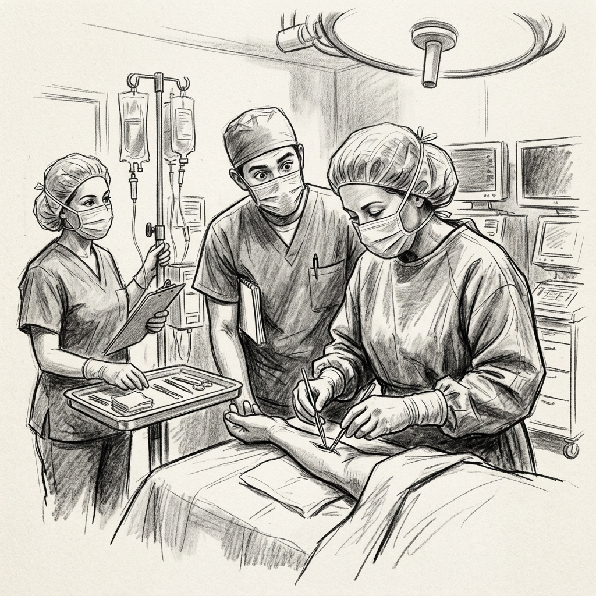
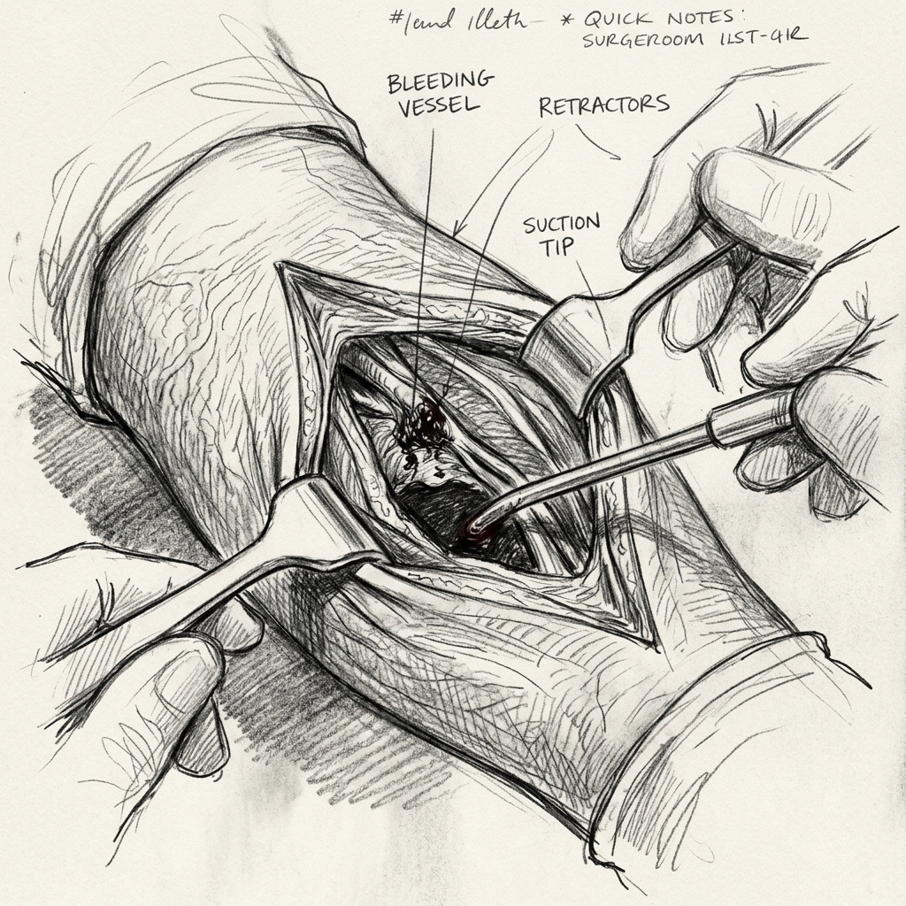
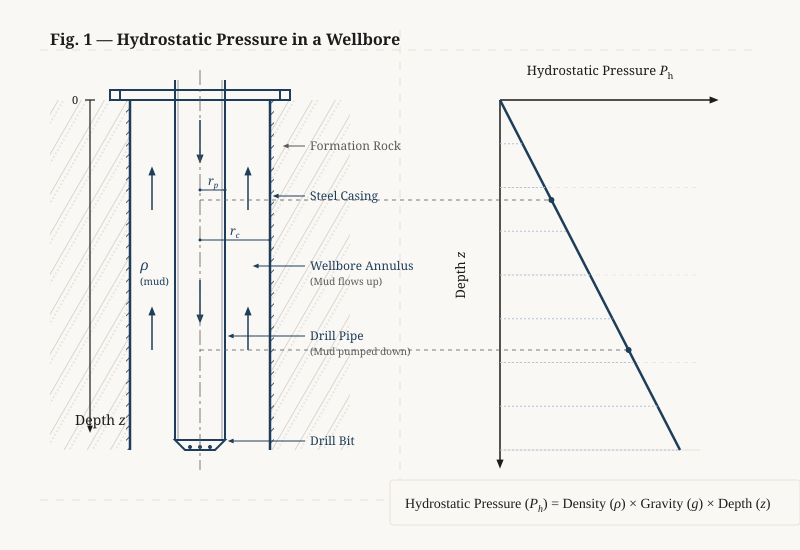
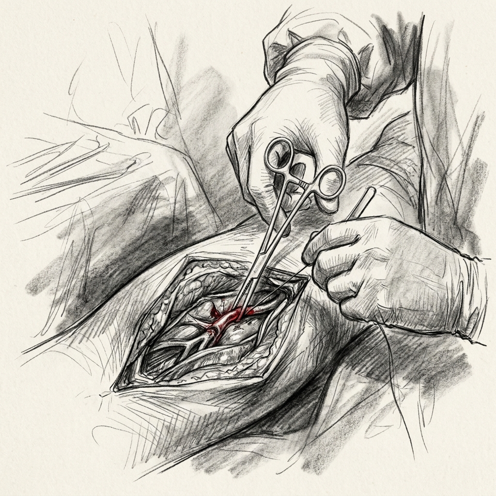
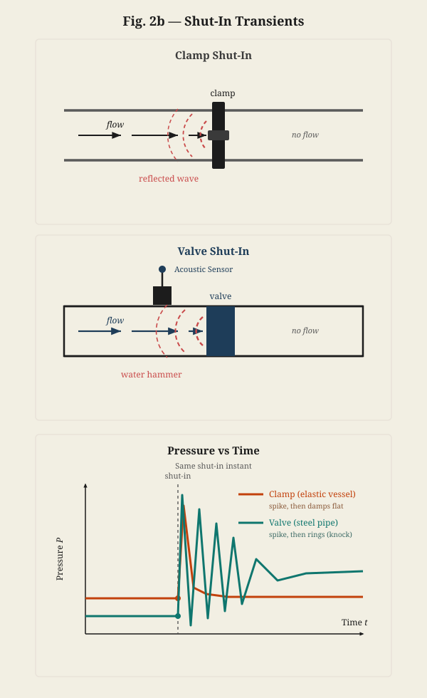
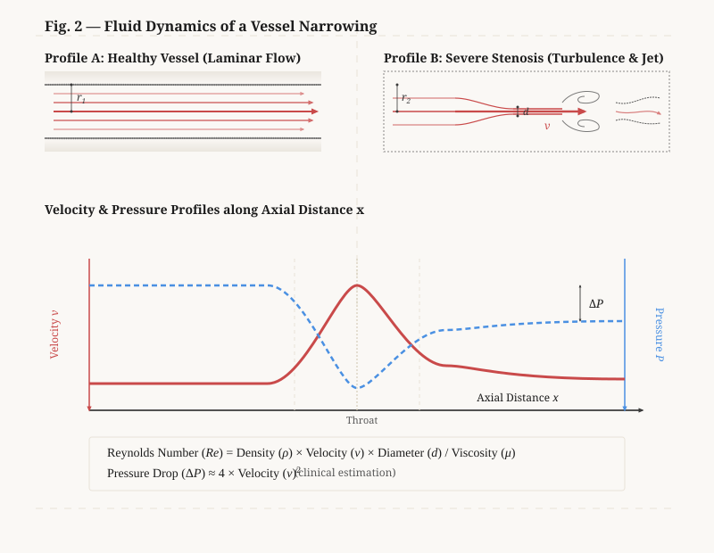
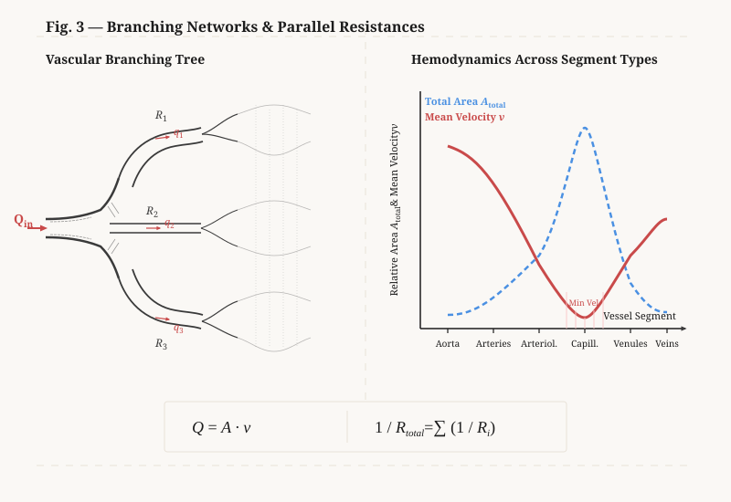
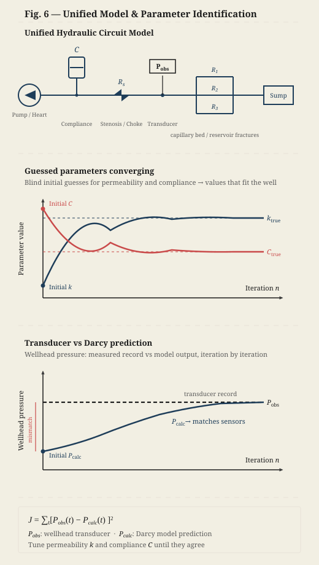
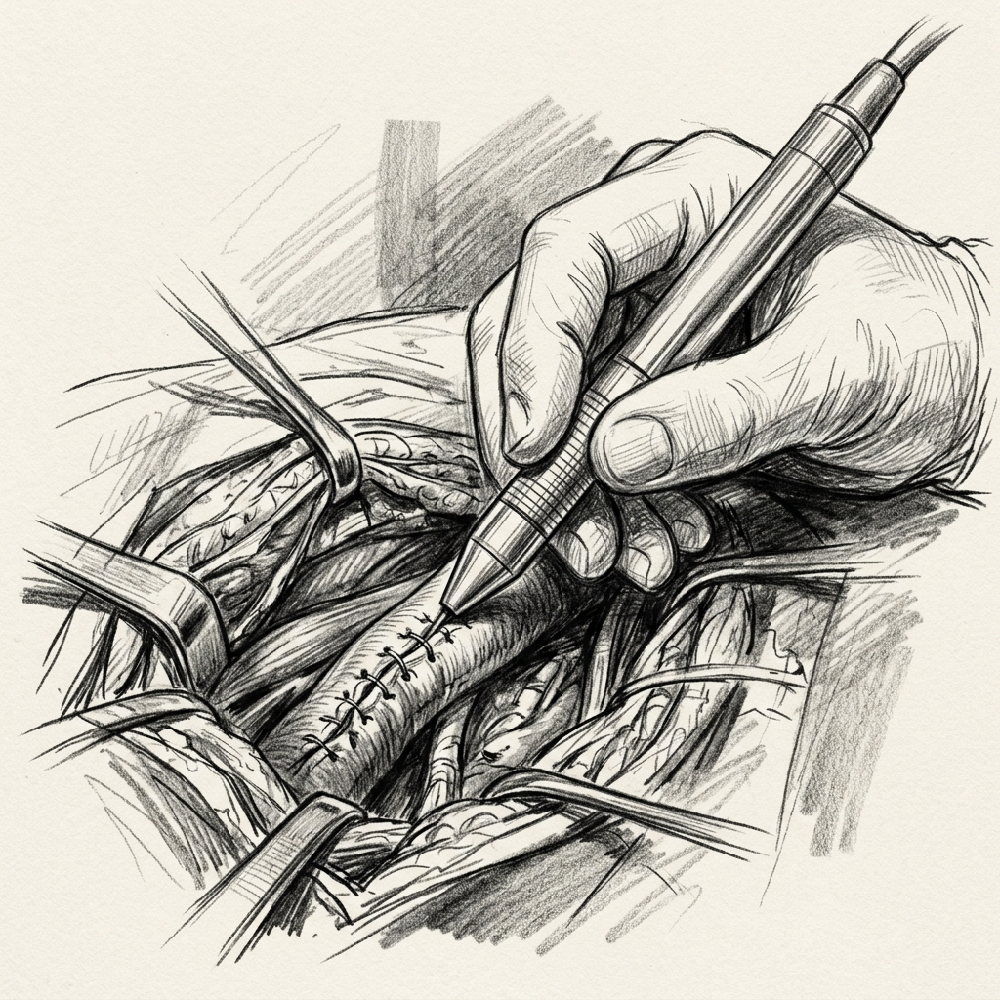
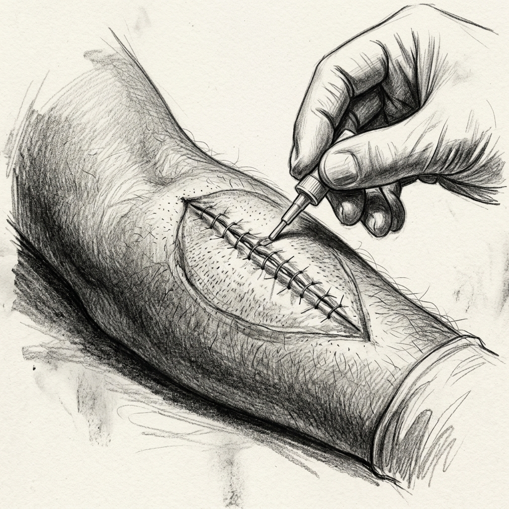

# Pulses and Pathways

## a Vascular Surgeon meets a Petroleum Engineer

  Preferred Presentation: This play is designed to be experienced with the script on center stage, and educational technical slides projected to the right.

# Dedication

This project is dedicated to the Reddit user [enquicity](https://www.reddit.com/user/enquicity/), whose brief recount of their surgery inspired this entire story.

*A special note from the author: I used Google Gemini to teach me in depth about both petroleum engineering and vascular surgery concepts so I could learn exactly how they're related, as I initially had only a shallow understanding of each—just enough to know there were underlying analogies waiting to be uncovered.*

# Act 1: The Bedside Question

<stage-row>
<play-text>

**Characters:**

* **DR. SARAH HAYES**: Vascular Surgeon. Calm, experienced, and observant.
* **MARK**: Patient. Anxious oil engineer, draped under local anesthesia.
* **STUART**: Third-year medical student, observing the surgery.
* **ELENA**: Circulating nurse, managing IV and vitals.

</play-text>
<projections></projections>
</stage-row>
---

<stage-row>
<play-text>

*[Scene Setting: Operating Room. The air is cool, hummed by the steady rhythm of the ventilation system. MARK lies supine on the operating table, his left arm extended on an armboard, prepped and draped. A sterile drape screen shields his face from the surgical field. DR. SARAH HAYES is bent over the arm, exploring the deep laceration. STUART stands beside her, holding a retractor and observing. ELENA stands near the vitals monitor, adjusting the IV line.]*

</play-text>
<projections>

</projections>
</stage-row>
<stage-row>
<play-text>

**DR. SARAH HAYES**: *[Without looking up, adjusting the focus of the surgical light]* Elena, let's keep the saline running wide open. Mark, you're doing great. How is the arm feeling?

</play-text>
<projections></projections>
</stage-row>
<stage-row>
<play-text>

**MARK**: *[Staring intently at the ceiling, his knuckles white as he grips the edge of the operating table]* It's... fine. I mean, I don't feel pain, Dr. Hayes. Just this bizarre tugging. Like someone is rooting around in a kitchen drawer, but the drawer is my wrist.

</play-text>
<projections></projections>
</stage-row>
<stage-row>
<play-text>

**DR. SARAH HAYES**: *[Using forceps to carefully dissect through the subcutaneous tissue]* That's the regional block. It completely shuts down the pain receptors, but you can still feel dull pressure and movement. It's a strange sensation, but it means the anesthetic is working exactly where we want it.

</play-text>
<projections></projections>
</stage-row>
<stage-row>
<play-text>

**ELENA**: *[Checking the vitals monitor]* Heart rate is ninety-six, blood pressure is one-thirty-eight over eighty-two. Vitals are stable, but he's running a little fast.

</play-text>
<projections></projections>
</stage-row>
<stage-row>
<play-text>

**DR. SARAH HAYES**: *[To Mark]* Completely normal under the circumstances. So, what is it you do, Mark?

</play-text>
<projections></projections>
</stage-row>
<stage-row>
<play-text>

**MARK**: *[Taking a shallow, rapid breath]* I'm an engineer. Reservoir and downhole hydraulics, offshore. We design the flow loops for drilling deep wells. Wellbore stability, hydrostatic balance, transient pressure modeling. It's... it's mostly math and physics, keeping the fluid columns from either collapsing the rock or blowing out the top.

</play-text>
<projections></projections>
</stage-row>
<stage-row>
<play-text>

**DR. SARAH HAYES**: *[Gently irrigating the wound with saline]* Hydrostatic balance. How does that work when you're drilling thousands of feet down?

</play-text>
<projections></projections>
</stage-row>
<stage-row>
<play-text>

**MARK**: *[Rambling quickly, his voice high-pitched]* It's all about density and depth. The formation rock is under immense pressure from the fluids trapped inside it. If we don't counter that pressure, the gas or oil kicks into the well, and you get a blowout. So we pump a dense drilling fluid, what we call drilling mud, down the drill pipe and up the annulus...

</play-text>
<projections></projections>
</stage-row>
<stage-row>
<play-text>

**STUART**: *[Frowning behind his mask]* The annulus? Like the mitral valve annulus?

</play-text>
<projections></projections>
</stage-row>
<stage-row>
<play-text>

**MARK**: What? No. In drilling, an annulus is just the empty ring-shaped space between the inner drill pipe and the outer steel casing. It's the return path. Anyway, we have to design the hydrostatic pressure to be greater than the pore pressure of the formation but less than the fracture pressure of the rock.

</play-text>
<projections></projections>
</stage-row>
<stage-row>
<play-text>

**STUART**: *[Leaning closer to the wound]* So the mud just sits there?

</play-text>
<projections></projections>
</stage-row>
<stage-row>
<play-text>

**MARK**: *[Shaking his head, staring at the ceiling]* No, it's constantly circulating. But the static base of it is pure hydrostatic pressure. It's P-h equals rho gee zee. Density rho of the mud, gravity gee, and vertical depth zee. If we don't control the density, the whole system destabilizes. If the mud is too light, the well kicks. If it's too heavy, we fracture the reservoir and lose all our fluid into the rock, which drops the hydrostatic column and triggers a kick anyway. It's a very tight window.

</play-text>
<projections>

> [!NOTE]
> **Hydrostatic Pressure**
> $P_h = \rho g z$
> Pressure ($P_h$) increases linearly with depth ($z$), assuming constant fluid density ($\rho$) and gravity ($g$).

</projections>
</stage-row>
<stage-row>
<play-text>

**DR. SARAH HAYES**: *[Using a suction tip to clear the surgical field]* And how do you model the flow along the well? If it's circulating, it's not static anymore.

</play-text>
<projections></projections>
</stage-row>
<stage-row>
<play-text>

**MARK**: *[Wiggling his uninjured right hand]* Right! Exactly. Once it's moving, you have to add the dynamic frictional losses. It becomes a hydrodynamic problem. It's tough to explain without drawing. I'm a visual guy, Dr. Hayes. If I don't draw, my brain just focuses on what you're doing over there.

</play-text>
<projections></projections>
</stage-row>
<stage-row>
<play-text>

**DR. SARAH HAYES**: *[Chuckles]* Stuart, let's help him out. Is there a sterile marker and a clean drape packet backing?

</play-text>
<projections></projections>
</stage-row>
<stage-row>
<play-text>

**STUART**: *[Retrieves a sterile skin marker and grabs a clean, stiff paper backing from a drape pack, holding it up in front of Mark's face]* Here you go, Mark. Draw it out. I'll hold it steady for you.

</play-text>
<projections></projections>
</stage-row>
<stage-row>
<play-text>

**MARK**: *[Takes the marker with his right hand and begins sketching rapidly on the paper backing, his hand trembling slightly but drawing clean, precise lines. He draws a concentric pipe diagram, arrows indicating flow direction, a graph, and the governing hydrostatic equation]* Okay, look. This is how we visualize the system.

</play-text>
<projections>

</projections>
</stage-row>
<stage-row>
<play-text>

**MARK**: *[Pointing with the marker]* In the left panel, you see the physical layout. The outer boundary is the steel casing. The inner tube is the drill pipe. The mud goes down the inside of the drill pipe and comes up that gap between them we just talked about—the annulus. And the mud is thick. It's not like water. It's basically a clay slurry. It won't even start flowing until you push it hard enough, and once it does start moving, it actually thins out the faster you pump it.

</play-text>
<projections></projections>
</stage-row>
<stage-row>
<play-text>

**DR. SARAH HAYES**: *[Carefully dissecting around the ulnar artery]* Fascinating. So the fluid doesn't just flow smoothly like water through a hose.

</play-text>
<projections></projections>
</stage-row>
<stage-row>
<play-text>

**MARK**: *[Nodding nervously]* Exactly! It moves more like a solid plug in the center, with all the shearing happening right against the walls. Plus, the drill pipe is rotating, which churns the fluid even more. The graph on the right of my sketch shows the hydrostatic pressure increasing linearly with depth. But when the pumps are on, the total pressure at any depth is the sum of the static weight of the fluid and the dynamic friction from pumping it.

</play-text>
<projections></projections>
</stage-row>
<stage-row>
<play-text>

**STUART**: *[Holding the retractor, eyes wide]* So the pressure is higher when you're pumping?

</play-text>
<projections></projections>
</stage-row>
<stage-row>
<play-text>

**MARK**: *[Sweat beads forming on his forehead]* Much higher. We call it the Equivalent Circulating Density, or ECD. It's the effective density the wellbore walls feel. If the ECD spikes because of high flow rates or a restriction in the annulus, we risk breaking the formation. We run computer simulations on it, breaking the whole well down into chunks. You can't just calculate it on paper because the mud gets compressed and heated the deeper it goes, changing how it flows at every single foot.

</play-text>
<projections></projections>
</stage-row>
<stage-row>
<play-text>

**DR. SARAH HAYES**: *[Locating the lacerated vessel, her movements precise]* A hydraulic network. A pump, a conduit, and resistance. It's the same physics, whether it's steel casing or the ulnar artery.

*[Dr. Hayes preparing to clamp the severed vessel to isolate the bleeding. Stuart is holding the retractor.]*

</play-text>
<projections>

</projections>
</stage-row>
<stage-row>
<play-text>

**DR. SARAH HAYES**: Okay, we're ready to control the flow. Stuart, hold this retractor right there. Let's clamp the proximal end first. Watch the pressure.

</play-text>
<projections></projections>
</stage-row>
<stage-row>
<play-text>

**MARK**: *[Watches the ceiling, sweating, and says]* Clamping the flow. That's a valve shut-in. You're going to see a transient pressure spike upstream of that clamp.

</play-text>
<projections></projections>
</stage-row>

# The Hydraulic Conversation

## Act 2: Pressure and Flow

<stage-row>
<play-text>

**SETTING:**
An operating room. Dr. Hayes is clamping the artery. Stuart is retracting and assisting with suction. Elena is passing instruments. Mark lies on the operating table under a regional block.

</play-text>
<projections></projections>
</stage-row>
---

<stage-row>
<play-text>

**MARK**
Clamping the flow. That's a valve shut-in. You're going to see a transient pressure spike upstream of that clamp.

</play-text>
<projections></projections>
</stage-row>
<stage-row>
<play-text>

**DR. SARAH HAYES**
*[With a firm but gentle click, she locks the teeth of a vascular clamp across the brachial artery branch. She watches the arterial monitor mounted on the anesthesia pole.]*

</play-text>
<projections>

</projections>
</stage-row>
<stage-row>
<play-text>

Confirmed. There's the upward deflection on the arterial line pressure transducer. The pressure waveform just spiked upstream.

</play-text>
<projections></projections>
</stage-row>
<stage-row>
<play-text>

**STUART**
*[Straining slightly as he holds the retractors, his eyes darting to the monitor]*
Look at the shape of the wave. The peak systolic pressure is up, but the normal dicrotic notch—the dip from the aortic valve closure—is completely washed out by the reflection.

</play-text>
<projections></projections>
</stage-row>
<stage-row>
<play-text>

**DR. SARAH HAYES**
*[Without looking up, she stabilizes the clamped vessel with DeBakey forceps]*
Ten points for quoting the physiology textbook verbatim, Stuart. But yes, exactly. The clamp creates a complete reflection boundary. In vascular systems, when we shut off a major branch, that reflected pressure wave travels backward toward the heart. If this were a larger vessel, like the aorta, the sudden increase in afterload could strain the left ventricle. In peripheral vessels, we listen for that reflection or obstruction. If there's a partial blockage downstream, the turbulence creates a murmur—or what we call a bruit.

</play-text>
<projections></projections>
</stage-row>
<stage-row>
<play-text>

**MARK**
*[Nervously tapping his free left hand against the arm board]*
We listen for the same thing in wells and pipelines. When a valve shuts in, it generates a transient shock wave—a water hammer—that bounces back and forth. We hear it as 'well knocking' or metallic pinging. The frequency and amplitude of the acoustic reflection tell us where the blockage or restriction is.

</play-text>
<projections>

> [!NOTE]
> **Acoustic Signatures of Turbulence**
> In both systems, a downstream restriction causes upstream flow turbulence that creates audible acoustic vibrations. A **bruit** is a continuous, low-frequency murmur, whereas **well knocking** presents as a sharp, high-amplitude transient spike.

</projections>
</stage-row>
<stage-row>
<play-text>

**DR. SARAH HAYES**
*[Gently dab-drying the tissue with a gauze sponge]*
And keeping that flow path clear is everything. Elena, pass the irrigation syringe and a fine retractor. Stuart, hold this retracting loop. We need to expose the bifurcation.

*[Elena hands Dr. Hayes a syringe filled with heparinized saline. Dr. Hayes washes the surgical field. Stuart takes the retractor, maintaining the exposure.]*

</play-text>
<projections></projections>
</stage-row>
<stage-row>
<play-text>

**STUART**
*[Adjusting his grip]*
It's all about diameter. Even a tiny reduction in the vessel's radius drastically increases resistance. In physiology, we learn Poiseuille's law. Resistance to flow is inversely proportional to the fourth power of the radius.

</play-text>
<projections>

> [!NOTE]
> **Poiseuille's Law Derivation**
> $Q \propto r^4 \implies R \propto 1/r^4$
> **1.** Area scales with $r^2$ ($\pi r^2$)
> **2.** Velocity profile scales with $r^2$ (wall friction)
> **3.** Flow ($Q$) = Area $\times$ Velocity $\propto r^2 \times r^2 = r^4$

</projections>
</stage-row>
<stage-row>
<play-text>

**MARK**
*[Shifting his head to look at Stuart]*
Hold on, Stuart. You're talking about the Hagen-Poiseuille equation. Do they teach you *why* it's to the fourth power in medical school?

</play-text>
<projections></projections>
</stage-row>
<stage-row>
<play-text>

**STUART**
*[Blinking, momentarily caught off guard]*
Well, it's just the formula for resistance.

</play-text>
<projections></projections>
</stage-row>
<stage-row>
<play-text>

**MARK**
It's just geometry! Flow is velocity times area. The cross-sectional area of a pipe is proportional to the radius squared. And the fluid velocity—because of the parabolic friction profile dragging against the walls—is *also* proportional to the radius squared. You multiply an $r$-squared area by an $r$-squared velocity, and you get an $r$ to the fourth power flow rate. But in engineering, we always qualify its assumptions. You can only rely on that inverse fourth-power rule if the flow is laminar, steady, and the fluid is Newtonian, running through a straight, rigid cylinder. Is your patient's artery a straight, rigid pipe?

</play-text>
<projections></projections>
</stage-row>
<stage-row>
<play-text>

**DR. SARAH HAYES**
*[Chuckling softly behind her mask]*
Hardly. Blood vessels are curved, tapered, elastic, and branch continuously. And blood is non-Newtonian—it's shear-thinning. At high shear rates in the large arteries, the red blood cells deform and align, lowering the viscosity. But in the micro-circulation, where the shear rate drops, they clump together, and viscosity climbs.

</play-text>
<projections></projections>
</stage-row>
<stage-row>
<play-text>

**MARK**
Exactly. And when you have a narrowing—a stenosis in a vessel, or a choke valve in a wellbore—those ideal assumptions break down completely. Elena, can you hand me my notepad? The clean page.

*[Elena reaches for the metal-backed clipboard on Mark's side table, flipping to his fresh sketch.]*

</play-text>
<projections></projections>
</stage-row>
<stage-row>
<play-text>

**MARK**
Look at this sketch here.

*[Elena holds the clipboard up under the bright surgical lights. Stuart leans in slightly while keeping the suction tip steady in his left hand.]*

</play-text>
<projections>

</projections>
</stage-row>
<stage-row>
<play-text>

**MARK**
Look at Profile A, the healthy vessel with a normal radius and smooth, parabolic laminar streamlines. But in Profile B, where you have severe stenosis with a severely restricted radius, the fluid has to accelerate to maintain the volumetric flow rate. As it passes through that throat of the narrowest diameter, the local velocity spikes. You can see it on the velocity curve below—it shoots straight up at the throat.

</play-text>
<projections></projections>
</stage-row>
<stage-row>
<play-text>

**STUART**
And the pressure curve does the opposite—it drops dramatically at the throat. It's the Bernoulli principle. The kinetic energy increases, so the static pressure must drop.

</play-text>
<projections></projections>
</stage-row>
<stage-row>
<play-text>

**MARK**
*[Points to the chaotic swirls in Profile B]* Right. But look at what happens downstream of the throat in Profile B. The velocity jet exits the constriction, and the sudden expansion causes flow separation. The fluid can't decelerate smoothly, so it sheds its kinetic energy into chaotic, recirculating eddies and vortices. That's turbulence. It's governed by the Reynolds number—which is basically just the fluid's density times its velocity times the pipe diameter, all divided by the fluid's viscosity.

</play-text>
<projections>

> [!NOTE]
> **The Reynolds Number ($Re$)**
> $Re = \frac{\rho v d}{\mu}$
> A dimensionless quantity used to predict fluid flow patterns. High values indicate turbulence (chaotic eddies), while low values indicate laminar (smooth) flow.

</projections>
</stage-row>
<stage-row>
<play-text>

**DR. SARAH HAYES**
*[Using a cotton-tipped applicator to clean the arterial adventitia]*
And in a blood vessel, that downstream turbulence isn't just an energy loss—which shows up as that permanent pressure drop, $\Delta P$, on your graph. It's biologically active. The chaotic flow and high shear stresses physically deform the endothelial cells lining the vessel. Worse, they activate platelets. Stuart, what happens when platelets are exposed to high shear and turbulence?

</play-text>
<projections></projections>
</stage-row>
<stage-row>
<play-text>

**STUART**
They activate, change shape, release dense granules, and aggregate. It triggers the coagulation cascade, forming a thrombus right downstream of the stenosis.

</play-text>
<projections></projections>
</stage-row>
<stage-row>
<play-text>

**DR. SARAH HAYES**
Yes. The body tries to plug what it perceives as a tear, but instead, it creates a total occlusion. That's how a minor plaque narrowing suddenly becomes an acute myocardial infarction or a stroke.

</play-text>
<projections></projections>
</stage-row>
<stage-row>
<play-text>

**MARK**
*[His eyes wide, staring at the ceiling tiles]*
Fascinating. In a pipeline or a centrifugal pump, if that velocity spike at a constriction is high enough, the local static pressure doesn't just drop—it falls below the vapor pressure of the fluid. The liquid literally boils at room temperature, flashing into tiny vapor cavities. We call it cavitation.

</play-text>
<projections></projections>
</stage-row>
<stage-row>
<play-text>

**STUART**
Wait, does blood boil in the body?

</play-text>
<projections></projections>
</stage-row>
<stage-row>
<play-text>

**MARK**
No, not boiling in the thermal sense. But those vapor bubbles travel downstream into a higher-pressure region, where they collapse. The implosion is so violent that it shoots micro-jets of liquid at supersonic speeds. It eats away at steel impellers, pitting them until they fail. If cavitation can destroy solid steel, I can't imagine what it does to living tissue.

</play-text>
<projections></projections>
</stage-row>
<stage-row>
<play-text>

**DR. SARAH HAYES**
*[Adjusting her surgical loupes, her fingers carefully placing a damp laparotomy sponge around the clamp]*
We actually see cavitation in medicine, specifically with mechanical heart valves. When the rigid carbon leaflets slam shut, the rapid deceleration and local flow squeeze create transient, extreme low-pressure fields. If the pressure drops below blood's vapor pressure, micro-bubbles form and immediately collapse on the valve structure or adjacent red blood cells. The shear stresses from those implosions hemolyze the red cells and activate platelets. That's why patients with mechanical valves require warfarin for the rest of their lives—to prevent the clots triggered by that mechanical turbulence.

</play-text>
<projections></projections>
</stage-row>
<stage-row>
<play-text>

**MARK**
So the whole system is a balance of pressure gradients and local geometries. Let's look at the next page of my sketch.

*[Elena carefully flips the clipboard page to reveal the next diagram.]*

</play-text>
<projections>

</projections>
</stage-row>
<stage-row>
<play-text>

**MARK**
Look at the left panel, the Vascular Branching Tree. You have a main inlet main inlet flow entering the aorta, which branches into smaller arteries with their own individual resistances and flow rates. It's a parallel network. The total resistance of a parallel system is always less than the resistance of any single branch. That's how

</play-text>
<projections>

> [!NOTE]
> **Parallel Hydraulic Resistance**
> $\frac{1}{R_{total}} = \sum \frac{1}{R_i}$
> The total resistance of the vascular bed drops as more parallel branches are added. you distribute flow to different organs without needing a massive pressure head at the main pump.

</projections>
</stage-row>
<stage-row>
<play-text>

**STUART**
And look at the graph on the right. The total cross-sectional area is tiny in the aorta, but it increases exponentially as the vessels branch into millions of arterioles and capillaries, peaking in the capillary bed. Because of the continuity equation, where volumetric flow equals the cross-sectional area times velocity, the mean flow velocity is inversely proportional

</play-text>
<projections>

> [!NOTE]
> **Continuity Equation**
> $Q = A \cdot v$
> To maintain a constant flow rate $Q$, if the area $A$ increases, the velocity $v$ must decrease. to the total area. So, velocity is highest in the aorta and drops to an absolute minimum in the capillaries.

</projections>
</stage-row>
<stage-row>
<play-text>

**DR. SARAH HAYES**
*[Nodding in agreement, her hands moving back to the surgical field]*
Which is perfect for physiology. The blood slows down to a crawl in the capillaries—that 'Min Vel.' region on your graph—giving oxygen and nutrients enough time to diffuse across the single-cell-thick endothelial walls into the tissue. If blood moved through the capillaries at the speed it leaves the heart, we'd starve of oxygen.

</play-text>
<projections></projections>
</stage-row>
<stage-row>
<play-text>

**MARK**
It's the exact same principle we use in gravel packs and reservoir sands. We slow down the fluid velocity near the wellbore by expanding the flow area, preventing high-velocity erosion and sand production.

</play-text>
<projections></projections>
</stage-row>
<stage-row>
<play-text>

**DR. SARAH HAYES**
*[Taking a bulb syringe loaded with sterile saline from Elena]*
Everything in the body is designed to manage these gradients without structural failure. But we're working with living cells, not synthetic composites.

*[Dr. Hayes gently washes the wound with saline, the fluid pooling and carrying away tiny drops of blood.]*

</play-text>
<projections></projections>
</stage-row>
<stage-row>
<play-text>

**DR. SARAH HAYES**
Stuart, irrigate here. Let's clear this field. The tissue walls here are incredibly delicate—look at the adventitia. They aren't steel.

</play-text>
<projections></projections>
</stage-row>
<stage-row>
<play-text>

**MARK**
No. Steel pipes don't breathe. They just sit there and take the pressure until they don't.

</play-text>
<projections></projections>
</stage-row>

# The Hydraulic Conversation

## Act 3: Living Pipes

<stage-row>
<play-text>

**SETTING:**
An operating room. Dr. Hayes is preparing the Prolene sutures for the arterial anastomosis. Stuart holds the suction and assists. Elena is preparing the suture line. Mark lies on the operating table under a regional block.

</play-text>
<projections></projections>
</stage-row>
---

<stage-row>
<play-text>

**MARK**
No. Steel pipes don't breathe. They just sit there and take the pressure until they don't.

</play-text>
<projections></projections>
</stage-row>
<stage-row>
<play-text>

**DR. SARAH HAYES**
*[Without looking up, she takes the micro-needle holder loaded with a 6-0 Prolene suture from Elena]*
Which is exactly why biology doesn't use steel. Living blood vessels are compliant. They expand during systole to accommodate the bolus of blood ejected by the heart, and contract during diastole.

</play-text>
<projections></projections>
</stage-row>
<stage-row>
<play-text>

**STUART**
*[Carefully adjusting the Senn retractor to maintain exposure of the artery's proximal end]*
It’s the Windkessel effect. The aorta acts as a temporary elastic reservoir, storing kinetic energy as potential energy during the peak pressure phase, then releasing it to maintain continuous perfusion even when the heart is relaxing between beats.

</play-text>
<projections></projections>
</stage-row>
<stage-row>
<play-text>

**MARK**
*[Nervously shifting his head, his left hand tapping the side table]*
In my world, we call that fluid-structure interaction, or FSI. We use gas-charged accumulators or surge tanks in pipeline networks to damp out pressure transients. Without that compliance, every stroke of a reciprocating pump would send a massive hammer wave through the line. The pressure spikes would fatigue the welds and blow out the flanges.

</play-text>
<projections></projections>
</stage-row>
<stage-row>
<play-text>

**DR. SARAH HAYES**
*[Gently irrigating the exposed artery with heparinized saline to prevent local clot formation]*
That’s exactly what happens when vessels stiffen with age or atherosclerosis. The compliance drops, and the system loses its damping capacity. Stuart, hold that suction tip right at the adventitial edge. Don't touch the intima.

</play-text>
<projections></projections>
</stage-row>
<stage-row>
<play-text>

**STUART**
*[Nods, stabilizing his hand and clearing a small pool of saline]*
Understood. If the wall is rigid, the pressure waveform changes.

</play-text>
<projections></projections>
</stage-row>
<stage-row>
<play-text>

**MARK**
*[Reaching for his notepad with his free left hand, Elena holds the page steady as he points to a pre-existing sketch]*
Like this one. I drew this out earlier when we were talking about transients.

*[Elena holds the notepad up so Dr. Hayes and Stuart can see the sketch under the surgical lights.]*

</play-text>
<projections>

</projections>
</stage-row>
<stage-row>
<play-text>

**MARK**
Look at the RC circuit analogy at the top—electrical resistance standing in for viscous fluid friction, and capacitance representing the compliance of the elastic walls. If compliance is high, like Curve A, you get a smooth, damp wave with a nice dicrotic notch from the valve closure. But if compliance drops—Curve B—the wave becomes sharp, jagged, and high-amplitude. The peak pressure spikes dramatically.

</play-text>
<projections></projections>
</stage-row>
<stage-row>
<play-text>

**DR. SARAH HAYES**
*[Peering through her surgical loupes, aligning the cut edges of the vessel]*
Yes, and that high-amplitude pressure wave travels downstream, damaging the delicate micro-circulation. But the physics is even more complex because the fluid itself isn't simple water.

</play-text>
<projections></projections>
</stage-row>
<stage-row>
<play-text>

**STUART**
Right, blood is non-Newtonian. It exhibits shear-thinning behavior. Under high shear rates in major arteries, the viscosity drops, allowing it to flow more easily. But at low shear rates, like in stagnant regions or micro-vessels, the red cells aggregate into rouleaux formations, and the viscosity rises. It even has a yield stress.

</play-text>
<projections></projections>
</stage-row>
<stage-row>
<play-text>

**MARK**
*[His eyes widening]*
Yield stress and shear-thinning? You're describing drilling muds. When we drill a well, we pump bentonite slurries or thixotropic polymer fluids down the drill string. When circulation stops, we need the mud to gel up—that's the yield stress—so the heavy rock cuttings don't settle back down and pack off the drill bit. But the second we restart the pumps, the shear stresses break the gel, the viscosity thins out, and it flows easily. You're telling me my body is pumping a thixotropic slurry through self-damping, elastic hoses?

</play-text>
<projections></projections>
</stage-row>
<stage-row>
<play-text>

**DR. SARAH HAYES**
*[A warm smile visible behind her mask]*
Essentially, yes. Though our thixotropic slurry will clot solid if we let it sit still for too long, which is why we have to keep these clamps temporary. Elena, pass the micro-forceps.

*[Elena places the fine jeweler's forceps into Dr. Hayes's hand. Dr. Hayes gently handles the vessel wall.]*

</play-text>
<projections></projections>
</stage-row>
<stage-row>
<play-text>

**DR. SARAH HAYES**
Look at the structural difference here. When your steel pipes fail under too much pressure, how does it look?

</play-text>
<projections></projections>
</stage-row>
<stage-row>
<play-text>

**MARK**
Well, it's a yield failure. Hoop stress—the circumferential tension in the pipe wall—is defined by the pressure times the radius divided by the wall thickness: $\sigma_\theta = \frac{Pr}{t}$. If the pressure exceeds the ultimate tensile strength of the steel, the pipe undergoes plastic deformation, thins out, and splits. It's a sudden, localized rupture.

*[Mark flips the page on his notepad to show another drawing]*

</play-text>
<projections>

</projections>
</stage-row>
<stage-row>
<play-text>

**MARK**
Left panel shows the steel casing under hoop stress, and the split failure when it yields. But look at the living vessel on the right.

</play-text>
<projections></projections>
</stage-row>
<stage-row>
<play-text>

**DR. SARAH HAYES**
*[Stitching a stay suture at the corner of the vessel]*
That right panel is the perfect model of an abdominal aortic aneurysm. As the arterial wall degenerates and loses its elastic fibers, the radius ballooning outwards increases, and the wall thickness decreases. By Laplace’s law, that balloon-like expansion drives the hoop stress up exponentially, even if the systemic pressure doesn't change. It's a runaway loop: more expansion leads to more stress, which causes more expansion, until the tissue simply tears.

</play-text>
<projections></projections>
</stage-row>
<stage-row>
<play-text>

**MARK**
A runaway failure under pressure. That's exactly how blowouts happen in our wells. Take the Deepwater Horizon in 2010. It was a cascade of barrier failures. The cement barrier at the bottom of the wellbore failed under high pressure, letting natural gas leak into the casing. As that gas migrated up the well, the hydrostatic pressure of the drilling mud column above it decreased. And because the pressure decreased, the gas expanded exponentially according to Boyle's law. It displaced the drilling mud, pushing it up and out of the riser. Once the mud was gone, the hydrostatic head was completely lost, and the reservoir pressure blew out uncontrollably at the surface.

</play-text>
<projections></projections>
</stage-row>
<stage-row>
<play-text>

**DR. SARAH HAYES**
*[Her expression turns serious as she listens, keeping her hands perfectly steady]*
The medical equivalent of that well blowout is a ruptured aneurysm. Once the vessel wall gives way, the high-pressure blood breaches the barrier. It blows out into the retroperitoneal or abdominal cavity. There is no mechanical barrier to contain it. The pressure drop is immediate, and the blood loss is catastrophic. The patient enters deep hypovolemic shock within minutes as the circulating volume is depleted. It is a complete and sudden loss of hydrostatic containment.

</play-text>
<projections></projections>
</stage-row>
<stage-row>
<play-text>

**STUART**
*[Tensely]*
And without immediate surgical clamping to restore containment, it’s fatal.

</play-text>
<projections></projections>
</stage-row>
<stage-row>
<play-text>

**DR. SARAH HAYES**
*[Adjusting the tension on the first stay suture]*
Exactly. Which is why we respect the pressure. Elena, prepare the 7-0 suture line. Stuart, keep the suction steady right on the adventitial margin. I need the lumen completely clear of blood for the first stitch.

*[Elena passes the micro-needle holder. Dr. Hayes adjusts the surgical loupes, leaning in close to the wound under the bright lights. She grips the micro-needle holder. Stuart holds the suction tip perfectly still, clearing a tiny bead of blood from the arterial edge. Dr. Hayes is suturing the vessel under magnification.]*

</play-text>
<projections></projections>
</stage-row>
<stage-row>
<play-text>

**DR. SARAH HAYES**
I'm starting the anastomosis now. Micro-sutures. We have to stitch this without narrowing the lumen too much, or we'll trigger the fourth-power resistance drop Stuart mentioned. But we can't see the flow inside yet. We'll have to infer it.

</play-text>
<projections></projections>
</stage-row>
<stage-row>
<play-text>

**MARK**
Inferring the unseen. That's my entire job.

</play-text>
<projections></projections>
</stage-row>

# The Hydraulic Conversation

## Act 4: Inverse Problems

<stage-row>
<play-text>

**SETTING:**
An operating room. Dr. Sarah Hayes is completing the final micro-sutures of the arterial repair. Stuart and Elena are assisting. Mark lies on the operating table under a regional block.

</play-text>
<projections></projections>
</stage-row>
---

<stage-row>
<play-text>

**MARK**
Inferring the unseen. That's my entire job.

</play-text>
<projections></projections>
</stage-row>
<stage-row>
<play-text>

**DR. SARAH HAYES**
*[Without looking up, her hands moving with microscopic precision as she loops a 7-0 Prolene suture]*
How so, Mark?

</play-text>
<projections></projections>
</stage-row>
<stage-row>
<play-text>

**MARK**
*[Nervously twitching his fingers, his eyes tracking the surgical light]*
Well, we can't actually go down into the reservoir. It's two miles beneath the seabed. We have no eyes down there. We can't see the spatial distribution of permeability or porosity. All we have are boundary measurements—pressures and flow rates measured at the wellhead over time. So we solve an inverse problem. We call it history matching. We build a numerical grid model of the reservoir, assign initial guesses to the permeability in each grid cell, and then run a forward simulation using Darcy's law.

</play-text>
<projections>

> [!NOTE]
> **Darcy's Law for Porous Media**
> $Q = -\frac{kA}{\mu} \frac{dP}{dx}$
> Flow $Q$ is driven by the pressure gradient $dP/dx$ and permeability $k$, and hindered by fluid viscosity $\mu$.

</projections>
</stage-row>
<stage-row>
<play-text>

**STUART**
*[Gently retracting the wound edge, squinting under the bright overhead light]*
So you calculate what the wellhead pressure *should* be, and compare it to the actual sensor data?

</play-text>
<projections></projections>
</stage-row>
<stage-row>
<play-text>

**MARK**
*[Napping his fingers as much as the sterile drapes allow]*
Exactly. We compare the calculated pressure against our observed pressure. Then we set up an optimization algorithm to minimize the error. We define a cost function—usually the sum of the squared residuals between the observed and calculated values. We run the simulation over and over, iteratively adjusting the permeability distribution and the compliance parameters of our reservoir model until that mathematical cost function converges toward zero.

</play-text>
<projections>

> [!NOTE]
> **Objective Cost Function (Error Minimization)**
> $J(x) = \sum [ y_{obs} - y_{calc}(x) ]^2$
> The algorithm iteratively tweaks model parameters $x$ to minimize the squared difference between observed reality and simulated predictions.

</projections>
</stage-row>
<stage-row>
<play-text>

**DR. SARAH HAYES**
*[Taking a pair of micro-scissors from Elena to cut the suture tail]*
We do the exact same thing, Mark. In medicine, we call our boundary measurements non-invasive diagnostics. We can't slice open your carotid artery just to check if a plaque is obstructing flow or to measure the local vascular resistance. Instead, we use boundary measurements like Doppler ultrasound.

</play-text>
<projections></projections>
</stage-row>
<stage-row>
<play-text>

**STUART**
*[Nodding eagerly]*
Right. The Doppler probe measures the frequency shift of the sound waves bouncing off the moving red blood cells, which gives us the fluid velocity. From that velocity, we reconstruct the pressure drop across a stenosis using the simplified Bernoulli equation.

</play-text>
<projections>

> [!NOTE]
> **Simplified Bernoulli Equation (Clinical)**
> $\Delta P \approx 4v^2$
> A fast clinical heuristic where peak velocity $v$ directly estimates the pressure gradient $\Delta P$ across a heart valve or stenosis.

</projections>
</stage-row>
<stage-row>
<play-text>

**DR. SARAH HAYES**
*[Adjusting the angle of her surgical loupes]*
And if we need a more detailed map of the geometry, we use CT angiography. We reconstruct the three-dimensional lumen, which Stuart can then feed into a computational fluid dynamics model to solve the Navier-Stokes equations. Or, if we have access to phase-contrast MRI, we can directly map the velocity vectors in three dimensions and calculate the local wall shear stress and pressure gradients from those velocity fields. We are mapping the invisible internals using only the signals that reach our sensors at the boundary.

</play-text>
<projections></projections>
</stage-row>
<stage-row>
<play-text>

**MARK**
*[Gesturing with his free left hand]*
Elena, could you flip to the next page of my notepad? The one I drew during the pre-op.

*[Elena carefully turns the page of the notepad and holds it up so Dr. Hayes and Stuart can see the diagram under the surgical lights.]*

</play-text>
<projections>

</projections>
</stage-row>
<stage-row>
<play-text>

**MARK**
Look at the top half. I drew a Unified Hydraulic Circuit Model. It applies to both of us. The heart or the pump feeds into a compliance chamber, representing the arterial elasticity or a surge accumulator. Then we hit a stenosis or a choke valve—that's our flow resistor. Right after it, we place our transducer to measure the observed pressure. Then the line splits into multiple parallel networks, modeling the branching capillary bed or the reservoir fractures, before draining into the venous sump.

</play-text>
<projections></projections>
</stage-row>
<stage-row>
<play-text>

**DR. SARAH HAYES**
*[Peering at the diagram, nodding in approval]*
And the bottom half shows the mathematical convergence.

</play-text>
<projections></projections>
</stage-row>
<stage-row>
<play-text>

**MARK**
Right. The plot on the left shows how our parameters—the resistance and compliance—start from initial blind guesses and converge over each iteration step toward their true physical values. And on the right, you see the error minimization, where the cost function decays toward zero. If the math works, the model matches the physical reality.

</play-text>
<projections></projections>
</stage-row>
<stage-row>
<play-text>

**DR. SARAH HAYES**
*[Gently grasping the needle holder]*
Let's hope my physical model matches the math. I've just placed the final micro-suture. Elena, saline irrigator.

*[Elena passes the syringe of heparinized saline. Dr. Hayes flushes the surgical field, verifying that the edges of the arterial anastomosis are perfectly aligned.]*

</play-text>
<projections></projections>
</stage-row>
<stage-row>
<play-text>

**DR. SARAH HAYES**
Ready to restore flow. Stuart, get the suction ready. Elena, micro-forceps.

*[Dr. Hayes carefully positions her fingers over the vascular clamps. She gently releases the distal clamp first to allow back-bleeding to clear any micro-bubbles, then releases the proximal clamp.]*

</play-text>
<projections></projections>
</stage-row>
<stage-row>
<play-text>

**STUART**
*[Leaning forward, his breath catching]*
The vessel is filling...

*[The repaired artery begins to swell, its walls pulsing rhythmically in time with Mark's heartbeat.]*

</play-text>
<projections></projections>
</stage-row>
<stage-row>
<play-text>

**DR. SARAH HAYES**
Anastomosis is patent. No suture line bleeding. Stuart, pass me the sterile Doppler probe. Let's get our boundary measurement.

</play-text>
<projections>

</projections>
</stage-row>
<stage-row>
<play-text>

*[Stuart hands the sterile ultrasound probe to Dr. Hayes. She gently places the tip against the pulsing artery. A loud, rhythmic, swooshing sound fills the operating room: WHOOSH-chhh, WHOOSH-chhh, WHOOSH-chhh.]*

</play-text>
<projections></projections>
</stage-row>
<stage-row>
<play-text>

**STUART**
*[Smiling widely]*
Strong triphasic flow. The waveform is beautiful.

</play-text>
<projections></projections>
</stage-row>
<stage-row>
<play-text>

**DR. SARAH HAYES**
*[Removing the probe and handing it back to Stuart]*
The pressure gradients are restored. The boundary measurements look perfect. Elena, let's close. We'll use 4-0 Monocryl for the subcutaneous layer and Dermabond for the skin.

*[Dr. Hayes begins closing the deeper tissue layers while Elena prepares the dressings. Stuart assists with the final skin closure. Within a few minutes, Elena wraps a clean, sterile bandage around Mark's arm.]*

</play-text>
<projections>

</projections>
</stage-row>
<stage-row>
<play-text>

**DR. SARAH HAYES**
All done, Mark. You have a brand new, watertight anastomosis.

</play-text>
<projections></projections>
</stage-row>
<stage-row>
<play-text>

**MARK**
*[Sighing with relief, his shoulders finally relaxing on the table]*
Thanks, Doc. I have to say, the pressure drop in my arm was a lot easier to fix than a pressure leak in a deepwater well. We don't have the luxury of putting sutures on a reservoir two miles down.

</play-text>
<projections></projections>
</stage-row>
<stage-row>
<play-text>

**DR. SARAH HAYES**
*[Pulling off her surgical gloves with a sharp snap and smiling warmly]*
Yes, well, you have to remember that I've had the benefit of several billion years of biological R&D to refine my vascular pipes. Evolution is a very patient engineer. Your steel casings have only had about a century.

</play-text>
<projections></projections>
</stage-row>
<stage-row>
<play-text>

**MARK**
*[Dryly]*
I'll make sure to mention that to our reservoir modeling team. They could use a few million years of R&D.

*[The team laughs softly as Elena begins clearing the surgical trays.]*

</play-text>
<projections></projections>
</stage-row>

