# Science arc (writer notes)

This file is **writer meta**, not script. The play reads **linear** (Act 1→5), but the **science** is a **DAG**: some beats need prior concepts; many are independent and can slide for timing or story.

See also: [case.md](case.md) (ops sync points / windows) · [characters.md](characters.md) (who speaks).

**How to use:** Before moving a teaching beat, check (1) hard edges below, (2) case sync points in `case.md`, (3) soft preferences. Prefer sliding a free node or an ops beat over inventing filler dialogue.

---

## Nodes (current inventory)

| id | Claim (one line) | Current home |
| --- | --- | --- |
| `hydrostatic_pressure` | Static column: \(P_h=\rho g z\). | Act 1 |
| `pore_fracture_mud_window` | Mud weight between pore and fracture pressure. | Act 1 |
| `annulus_return_path` | Return flow in the pipe–casing ring (≠ mitral annulus). | Act 1 |
| `mud_yield_shear_thinning` | Mud needs a push to start, then thins with shear. | Act 1 |
| `ecd_hydro_plus_friction` | Circulating pressure = hydrostatic + friction (ECD). | Act 1 |
| `depth_pvt_flow_variation` | Depth changes mud properties foot-by-foot. | Act 1 |
| `shut_in_transient` | Sudden closure launches an upstream pressure wave. | Act 2 |
| `water_hammer_bruit_map` | Well knocking ↔ listening for bruit. | Act 2 |
| `reflection_boundary_afterload` | Clamp = reflection boundary; waveform / afterload effects. | Act 2 |
| `poiseuille_r4` | Resistance ~ \(1/r^4\). | Act 2 |
| `choke_stenosis_map` | Wellhead choke ↔ vessel stenosis. | Act 2 |
| `blood_shear_dependent_viscosity` | High shear thins; low shear viscosity climbs. | Act 2 (deepened Act 4) |
| `bernoulli_throat` | At a constriction, velocity up, static pressure down. | Act 2 |
| `post_stenotic_separation` | Jet + expansion → recirculation / loss. | Act 2 |
| `reynolds_number` | \(Re=\rho v d/\mu\) marks flow regime. | Act 2 |
| `turbulence_thrombus_feedback` | Turbulent shear → platelets → narrower throat → runaway. | Act 2 |
| `cavitation_collapse` | \(P\) below vapor pressure → cavities; collapse punches. | Act 3 |
| `valve_cavitation_hemolysis_map` | Mechanical-valve slam ↔ cavitation damage to blood. | Act 3 |
| `parallel_branch_resistance` | \(1/R_{\mathrm{tot}}=\sum 1/R_i\). | Act 3 |
| `continuity_area_velocity` | \(Q=Av\); area up → velocity down. | Act 3 |
| `capillary_diffusion_time` | Slow capillary flow buys diffusion time. | Act 3 |
| `gravel_pack_area_map` | Expand area to cut near-wellbore velocity ↔ capillaries. | Act 3 |
| `windkessel_compliance` | Elastic aorta stores/releases → continuous perfusion. | Act 4 |
| `fsi_accumulator_map` | Accumulators / surge tanks ↔ vessel compliance. | Act 4 |
| `stiffening_loses_damping` | Less compliance → taller, sharper waves. | Act 4 |
| `rc_waveform_curves` | R–C analogy for pulse shape. | Act 4 |
| `yield_stress_stasis` | Stopped blood gels → clot risk; clamps temporary. | Act 4 |
| `thixotropic_mud_blood_map` | Mud gel-on-stop ↔ blood yield + shear-thinning. | Act 4 |
| `hoop_stress_laplace` | Hoop stress ~ \(Pr/t\); runaway dilation risk. | Act 4 |
| `barrier_cascade_blowout_map` | Stacked barriers / layered wall; media carries load. | Act 4 |
| `inverse_history_matching` | Infer interior from boundary \(P(t),Q(t)\). | Act 5 |
| `darcys_law` | Pore flux from ∇P vs viscosity / permeability. | Act 5 |
| `duplex_doppler_velocity` | Doppler shift → blood velocity. | Act 5 |
| `simplified_bernoulli_clinical` | Clinical \(\Delta P\approx 4v^2\) heuristic. | Act 5 |
| `cta_cfd_geometry` | CTA geometry → CFD of the invisible interior. | Act 5 |
| `pc_mri_wall_shear` | PC-MRI velocity fields → WSS / gradients. | Act 5 |
| `triphasic_vs_stenotic_spectrum` | Open runoff vs pursed high-peak spectrum. | Act 5 |
| `pursed_anastomosis_choke_map` | Over-tight suture throat like a choke; revise. | Act 5 |

Audience-only reminders (e.g. ideal-gas note beside cavitation) are not speaking nodes; they may travel with the node they annotate.

---

## Hard dependencies (must not reverse)

These are **hard** edges: do not put the child before the parent in the spoken evening.

```text
hydrostatic_pressure → pore_fracture_mud_window
hydrostatic_pressure → ecd_hydro_plus_friction
ecd_hydro_plus_friction → depth_pvt_flow_variation

shut_in_transient → water_hammer_bruit_map
shut_in_transient → reflection_boundary_afterload

poiseuille_r4 → choke_stenosis_map
bernoulli_throat → post_stenotic_separation
post_stenotic_separation → turbulence_thrombus_feedback
bernoulli_throat → cavitation_collapse   # throat ΔP / low static P picture
cavitation_collapse → valve_cavitation_hemolysis_map

continuity_area_velocity → capillary_diffusion_time
continuity_area_velocity → gravel_pack_area_map

windkessel_compliance → stiffening_loses_damping
windkessel_compliance → rc_waveform_curves
shut_in_transient → fsi_accumulator_map   # hammer needs a prior shut-in idea
windkessel_compliance → fsi_accumulator_map

mud_yield_shear_thinning → thixotropic_mud_blood_map
blood_shear_dependent_viscosity → yield_stress_stasis
blood_shear_dependent_viscosity → thixotropic_mud_blood_map
hoop_stress_laplace → barrier_cascade_blowout_map

duplex_doppler_velocity → triphasic_vs_stenotic_spectrum
choke_stenosis_map → pursed_anastomosis_choke_map
triphasic_vs_stenotic_spectrum → pursed_anastomosis_choke_map
poiseuille_r4 → pursed_anastomosis_choke_map
bernoulli_throat → simplified_bernoulli_clinical
```

---

## Soft preferences (may bend)

- `annulus_return_path` near first well sketch (Act 1) — pedagogical, not physics-forced.
- `reynolds_number` near Bernoulli / post-stenotic talk — nice adjacency, not required before cavitation if throat ΔP is already clear.
- `parallel_branch_resistance` before or after `continuity_area_velocity` — either order OK if both stay in a network window.
- `darcys_law` beside `inverse_history_matching` — thematic cluster, not a strict prerequisite.
- `cta_cfd_geometry` / `pc_mri_wall_shear` as optional imaging sidebar off inverse/duplex — can shorten or slide if Act 5 is overcrowded.
- Re-deepening `blood_shear_dependent_viscosity` in Act 4 after a light Act 2 pass — echo OK.

---

## Sync with case.md

Science nodes that **lock** to medical sync points / ops facts:

| Science node(s) | Case lock |
| --- | --- |
| `shut_in_transient`, `water_hammer_bruit_map`, `reflection_boundary_afterload` | Sync 3 — proximal clamp on / field quiet first |
| `inverse_history_matching`, `darcys_law` (as “sewing without watching flow”) | Sync 4 — anastomosis underway |
| `duplex_doppler_velocity`, `triphasic_vs_stenotic_spectrum`, `pursed_anastomosis_choke_map` | Syncs 5–6 — duplex → revise → good waveform → close |
| Block-wait teaching (`hydrostatic_*`, early mud/ECD) | Sync 1 — may breathe during block onset; not after cutting deeper without the sensation check |

**Free to drift** inside a holding / maintenance window (no sew): most of Act 3 network + cavitation cluster; much of Act 2 stenosis physics *after* clamp; Act 4 compliance/rheology/hoop while stays/prep — subject to hard edges above.

**Pacing baseline:** see [Pacing (case vs play)](#pacing-case-vs-play) below. Phase 2b concluded **no reorder**; Act 3 has spare hold air (cavitation expand home); if Act 5 still feels stuffed after that, trim imaging sidebar (`cta_cfd_geometry`, `pc_mri_wall_shear`) before breaking syncs 4–6.

---

## Pacing (case vs play)

Writer archive from Phase 2b. **Purpose:** baseline so future rewrites can see impact. Play time ≠ wall clock. Durations and who-can-talk: [case.md](case.md). Who speaks science: [characters.md](characters.md).

### Evening shape

- **Door-to-close** ~1.5–2.5 h (play-default midpoints ~**2 h**). That length can *be* the theatrical evening.
- First ~**30+ min from door** (Act 0 ED + block placement / early onset) sit mostly **outside full stage time** or as short prologue; Act 1 opens on “Block’s in.”
- On-stage Acts 1–5 ride roughly **dense-block / knife onward → close**, with theatrical stretch on holds for teaching (intentional, not a bug).

### Act snapshot (as of Phase 2b close)

Script size = source lines + dialogue cues (speaker labels). Cumulatives = midpoints from `case.md` door clock.

| Act | Ops window (wall) | Cum from door (mid) | Script size | Teach load | Hold vs critical | Fit |
| --- | --- | --- | --- | --- | --- | --- |
| **0** Handoff | ED accept minutes | ~15 min | ~32 lines, ~7 cues | none (story) | Brief prologue | **Good** |
| **1** Bedside | Block onset∥prep; find ends | ~45→60 min | ~94 lines, ~27 cues | hydrostatic / mud / ECD | **Hold** then find | **Good** — early teach window |
| **2** Narrowing | Clamp minutes + clear/expose | ~65→~80 | ~173 lines, ~35 cues | shut-in → stenosis / Bernoulli / thrombus | Clamp locked; talk rides exposure | **Dense but OK** |
| **3** Network | Prepare-ends hold; **no sew** | ~80 | ~63 lines, ~12 cues — **shortest** science act | cavitation + network / continuity | Pure **hold** | **Under-filled vs idle OR** — spare room for cavitation expand |
| **4** Living pipes | Stays / start sew | ~80→~110 | ~115 lines, ~25 cues | Windkessel / FSI / rheology / hoop | Hold → rising | **Good** |
| **5** Inverse | Anastomosis + duplex/revise/close | ~110→~130 | ~193 lines, ~34 cues — **longest** | inverse + Darcy + duplex + purse (+ imaging sidebar) | **Critical path** | **Dense and matched** to long sew |

### Conclusion (Phase 2b)

- **No science reorder.** Sync points and hard DAG edges already honored.
- Act 3 is surgically idle but script-short — prefer **expanding cavitation there** over pulling Act 5 content earlier.
- Act 5 density matches the longest wall-clock critical window; do not move inverse/duplex off the sew.
- Chat intensity is gated in `case.md` (Hayes flat at clamp / mid-sew / duplex; Priya idle ≠ seminar).

### If we rewrite later — impact checklist

Before moving or lengthening a teach beat:

1. **Hard DAG edges** (above) — do not reverse parent → child.
2. **Case syncs** (`case.md`) — especially clamp-before-shut-in; sew-before-inverse; duplex-before-revise/close.
3. **Intensity phase** (`case.md` Team intensity) — will Hayes be High (lean only) or Med (can carry maps)?
4. **Lengthening Act 5** — trim `cta_cfd_geometry` / `pc_mri_wall_shear` sidebar first.
5. **Empty hold on stage** — ops beat / notepad / screen check; not a new lecture; not Elena/Priya science chat.
6. **Update this snapshot** (line/cue counts and fit notes) if acts grow or shrink materially.

---

## Independent clusters (reorder freedom)

These clusters are mostly internally ordered but **weakly coupled** to each other — may slide whole clusters relative to each other if case syncs stay honest (Phase 2b left order as-is):

1. **Well control / hydrostatic** (Act 1) — early; natural on block wait.
2. **Shut-in / reflection** (Act 2) — locked after clamp.
3. **Stenosis / Bernoulli / thrombus cascade** (Act 2) — after clamp; before or interleaved with exposure.
4. **Cavitation + valves** (Act 3) — needs throat ΔP idea; good in hold-before-sew.
5. **Network parallel + continuity** (Act 3) — weak coupling to cavitation; either order inside Act 3.
6. **Compliance / FSI / rheology / hoop** (Act 4) — needs some shut-in + flow intuition; can borrow hold time from Act 3 if stays move.
7. **Inverse / duplex / choke revise** (Act 5) — locked to sew + duplex syncs; imaging sidebar optional.

---

## Mermaid (hard edges only)

```mermaid
flowchart TD
  hydro[hydrostatic_pressure] --> mudWin[pore_fracture_mud_window]
  hydro --> ecd[ecd_hydro_plus_friction]
  ecd --> depthPvt[depth_pvt_flow_variation]

  shutIn[shut_in_transient] --> hammer[water_hammer_bruit_map]
  shutIn --> reflect[reflection_boundary_afterload]
  shutIn --> fsi[fsi_accumulator_map]

  poiseuille[poiseuille_r4] --> chokeMap[choke_stenosis_map]
  poiseuille --> purse[pursed_anastomosis_choke_map]
  bernoulli[bernoulli_throat] --> separation[post_stenotic_separation]
  separation --> thrombus[turbulence_thrombus_feedback]
  bernoulli --> cavit[cavitation_collapse]
  bernoulli --> clinBern[simplified_bernoulli_clinical]
  cavit --> valveMap[valve_cavitation_hemolysis_map]

  cont[continuity_area_velocity] --> capillary[capillary_diffusion_time]
  cont --> gravel[gravel_pack_area_map]

  wind[windkessel_compliance] --> stiff[stiffening_loses_damping]
  wind --> rc[rc_waveform_curves]
  wind --> fsi

  mudYield[mud_yield_shear_thinning] --> thixo[thixotropic_mud_blood_map]
  bloodVisc[blood_shear_dependent_viscosity] --> yieldStasis[yield_stress_stasis]
  bloodVisc --> thixo
  hoop[hoop_stress_laplace] --> barrier[barrier_cascade_blowout_map]

  duplex[duplex_doppler_velocity] --> spectrum[triphasic_vs_stenotic_spectrum]
  spectrum --> purse
  chokeMap --> purse
```


